# Error Handling

Error handling in JavaScript and what a **try catch block** is.

* **Try Block** - let's us write a bit of code and test for errors.
* **Catch Block** - let's us handle those errors if there are any, and can also throw our own error message.

## Example of Reference Error
An example to see if we can catch an error through a failed reference to a function. 

<kbd>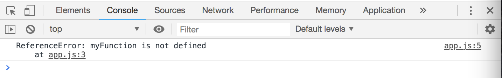</kbd>

What's nice about the **try catch** is that we can handle errors without stopping the entire script.

```
try {
  // will be a reference error
  myFunction();
} catch(error) {
  console.log(error)
}

console.log('Program continues...')
```

<kbd>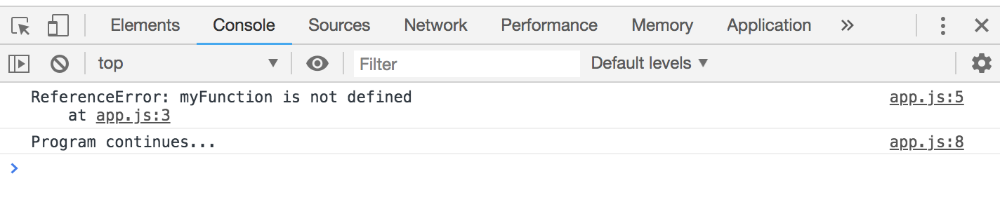</kbd>

If there's no **try catch**, you'll be given the red error message and we don't get the console.log, the script doesn't continue to run.

<kbd>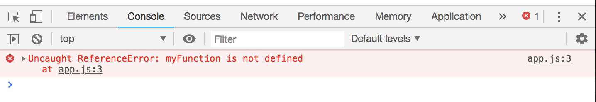</kbd>

If you want to get a message of what's causing the reference error, use ```console.log(error.message)```

```
try {
  // will be a reference error
  myFunction();
} catch(error) {
  console.log(error.message)
}

console.log('Program continues...')
```

<kbd>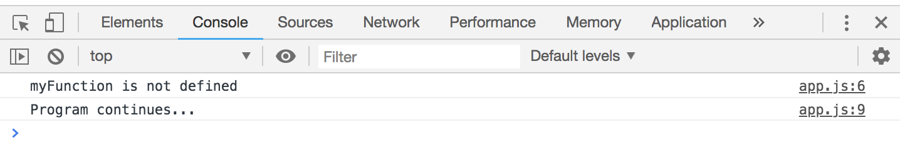</kbd>

If you just want to get the type of the name like **type error**, use ```console.log(error.name)```

```
try {
  // will be a reference error
  myFunction();
} catch(error) {
  console.log(error.name)
}

console.log('Program continues...')
```

<kbd>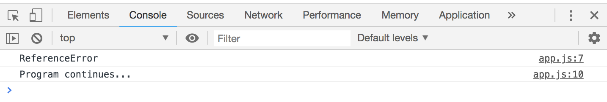</kbd>

```
try {
  myFunction();
} catch(error) {
  console.log(error)
} finally {
  console.log('Finally runs regardless of result')
}

console.log('Program continues...')
```

<kbd>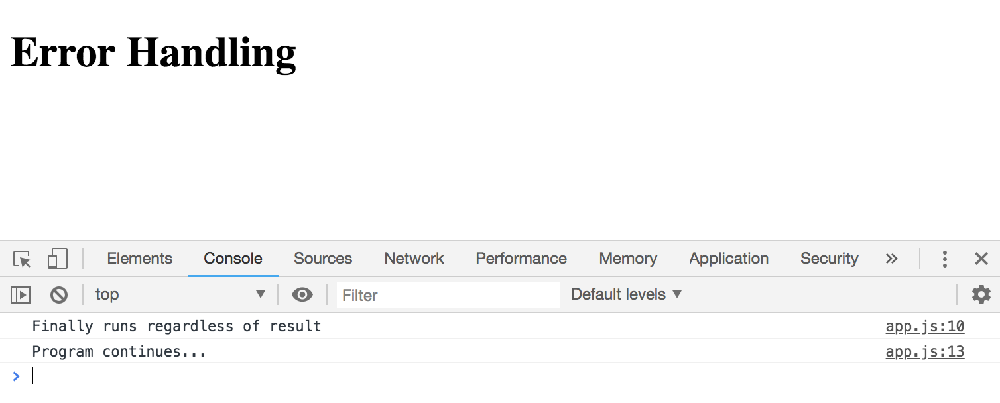</kbd>

## Example of Type Error

Take `null` and call something from it, like `myFunction()`. The error handling message can be formatted however way you want.

```
try {
  null.myFunction();
} catch(error) {
  console.log(`${error.name}: Null is the issue!`)
} finally {
  console.log('Finally runs regardless of result')
}

console.log('Program continues...')
```

<kbd>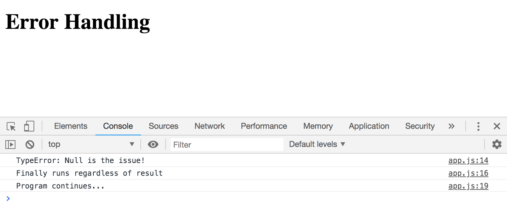</kbd>

## Example of Syntax Error

Use the `eval()` function, which will evaulate the JavaScript within a string.

**eval as number**

```
try {
  console.log(eval('4+4'));
} catch(error) {

} finally {
  console.log('Finally runs regardless of result')
}

console.log('Program continues...')
```

<kbd>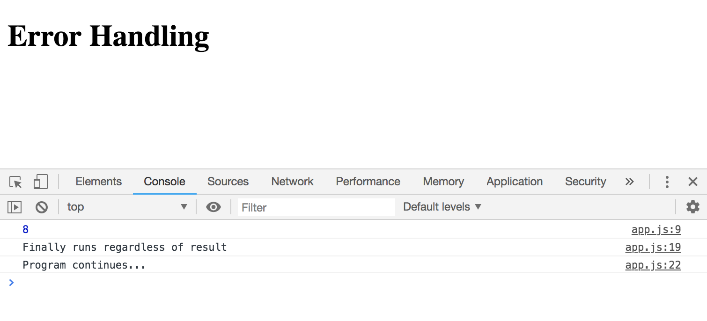</kbd>

**eval as variables**
```
try {
  console.log(eval('"Hello There!"'))
} catch(error) {

} finally {
  console.log('Finally runs regardless of result')
}

console.log('Program continues...')
```

<kbd>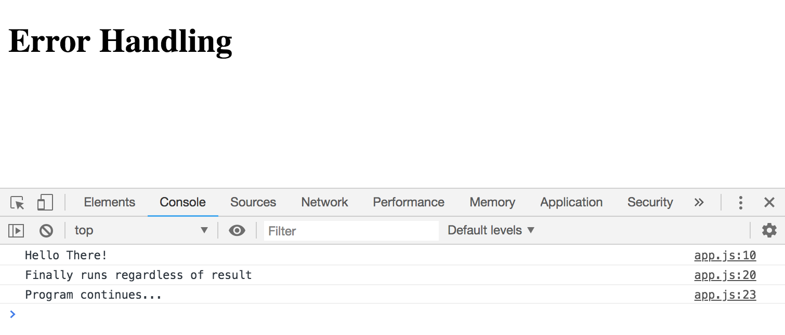</kbd>

## Example of URI Error

Use a functon called `decodeURIComponent` for this error handling.

```
try {
  decodeURIComponent('%');
} catch(error) {
  console.log(error)
} finally {
  console.log('Finally runs regardless of result')
}

console.log('Program continues...')
```

These are basically Global Error examples. We can create our own too.

## Create Own Error Messages

Check to make sure this user has a name (currently doesn't, only email)

```
const user = {email: 'johndoe@gmail.com'};

try {
  if (!user.name) {
    throw 'User does not have a name';
  }
} catch(error) {
  console.log(error);
}
```

<kbd>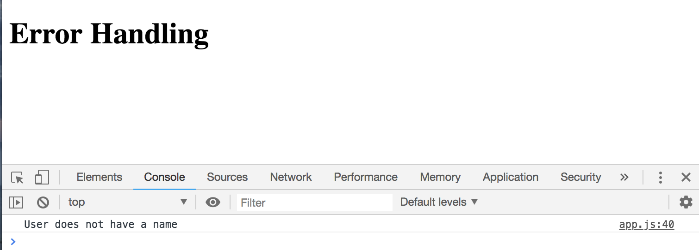</kbd>

```
const user = {email: 'johndoe@gmail.com'};

try {
  if (!user.name) {
    hrow new SyntaxError('User has no name');
  }
} catch(error) {
  console.log(error);
}
```

<kbd>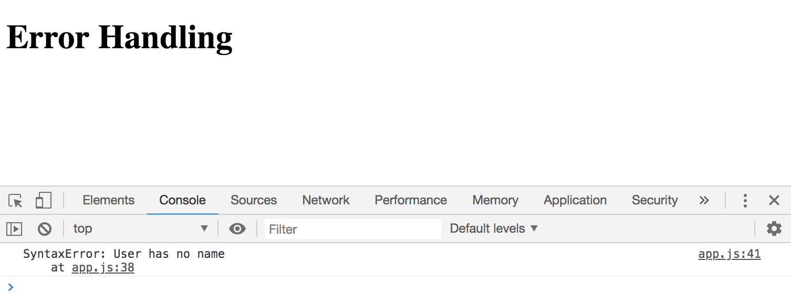</kbd>

```
const user = {email: 'johndoe@gmail.com'};

try {
  if (!user.name) {
    throw new SyntaxError('User has no name');
  }
} catch(error) {
  console.log(`User Error: ${error.message}`);
}
```

<kbd>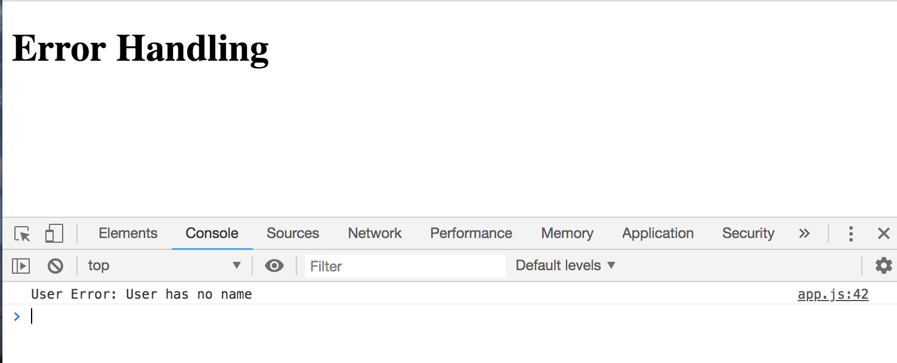</kbd>