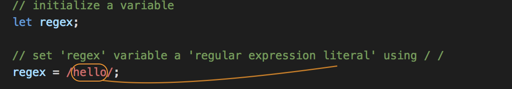
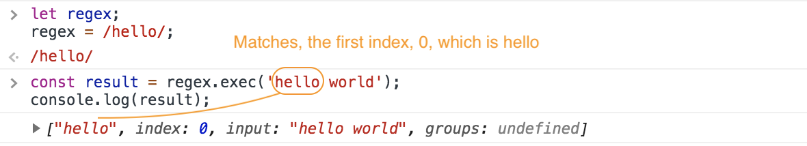
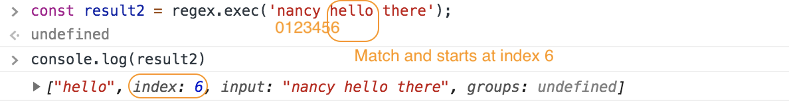
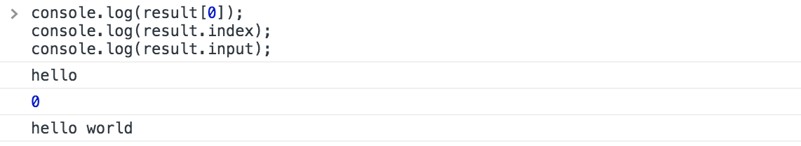
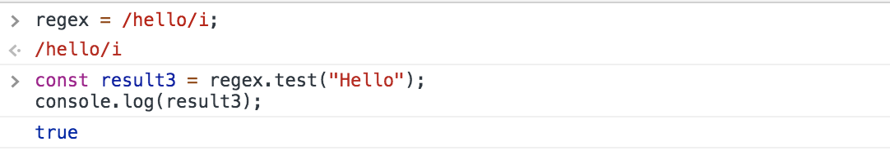
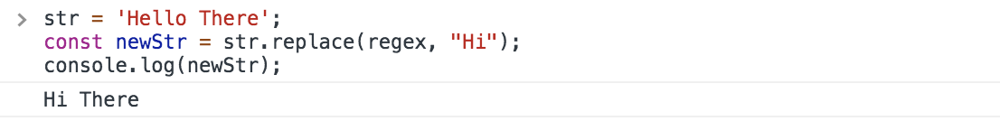

# Regular Expressions - Evaluation Functions

Regular Epressions are used to describe a pattern of characters like pattern matching, or searching. They're commonly used for vaidation as well as pulling things out of a body of the of a body of characters (e.g. email addresses, phone numbers, etc.)

## How to set Regular Expression Literal

<kbd></kbd>

Each one of these characters between `/ /` is literal, it's taken as face value, an actual `h`, `e`, `l`, `l`, `o`.

## Functions to Evaluate Expressions

* `exec()` - will return result in an array if there's a match or null if no match

<kbd></kbd>

Another example with different index started point of match.
<kbd></kbd>

More ways added to match.
<kbd></kbd>

* `test()` returns true or false

Adding `i` behind the slash makes it case-insensitive. `g` can be added as a global search, meaning that it'll continue to check all the way and not stop at the first match.
<kbd></kbd>

* `match()` - will return array or null, it's similar to `.exec()`

```
const str = 'Hello There';
const result = str.match(regex);
console.log(result);
```

* `search()` - will return the index of the first match, if not found, it'll return a `-1`

```
const str = 'Hello There';
const result = str.search(regex);
console.log(result);
```

* `replace()` - will return a new string with some or all matches

<kbd></kbd>