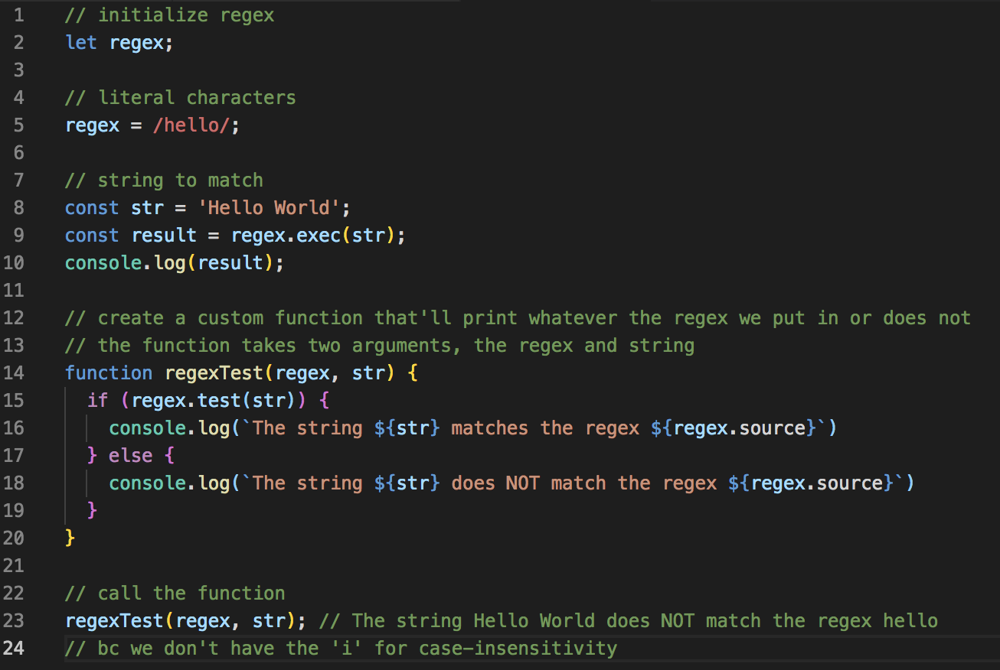
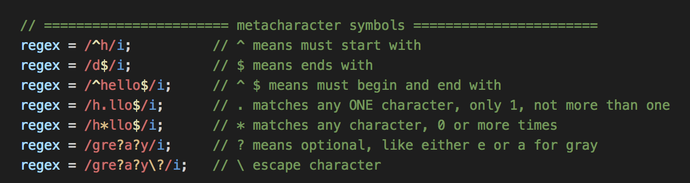

# RegEx Metacharacter Symbols

## Example of Literal Characters
<kbd></kbd>

## Metacharacter Symbols

`^` -  means must start with, put it before the first letter
<kbd></kbd>

`$` - means ends with, put it behind the last characters you want
<kbd></kbd>

`^ $` -  means must begin and end with, it can be combined

```
regex = /^hello$/i
```

`.` - means matches any ONE character, only 1, not more than one

```
regex = /h.llo$/i;
```

`*` - means matches any character, 0 or more times

```
regex = /h*llo$/i;
```

`?` - means optional, like either `e` or `a` for `gray`

```
regex = /gre?a?y/i;
```

`\` escape character

```
regex = /gre?a?y\?/i;

```

Metacharacters Quick Look

<kbd></kbd>

## Character Sets

Uses `[ ]` brackets. It's better thane the `?` optional one

<kbd></kbd>

## Quantifiers

Use `{ }` curly braces.

<kbd></kbd>

## Parentheses

Use `( )` for grouping.

<kbd></kbd>

## Shorthand Character Case

<kbd></kbd>

## Assertions

Assertions are kind of like conditionals.

<kbd></kbd>