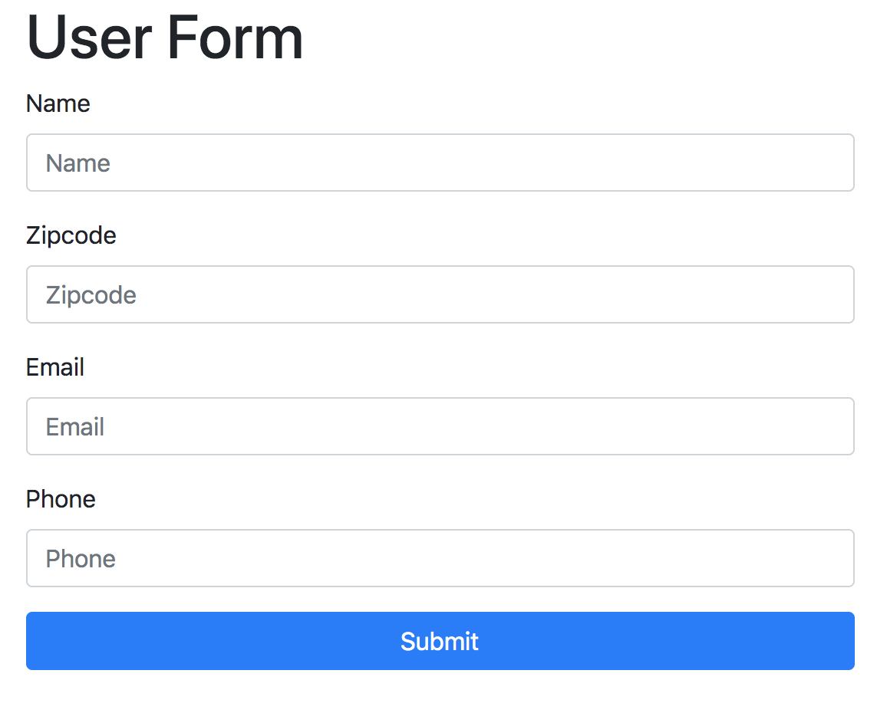

# Form Validation Project w/ RegEx

In our `form.js` file, we're going to add this Bootstrap class, `is-invalid` dynamically if the form has an input that doesn't match the requirement. It'll show an error message to the user.

## HTML Setup

<kbd></kbd>
<kbd></kbd>

**Add more fields to the form.**

<kbd></kbd>
<kbd></kbd>

## JS File to Make the Form Dynamic

The goal is to make the form dynamic, when the user starts filling the form, and if it's incorrect, it should have some kind of message to help guide the user to fill correctly the way the input field should be.

* We need to create a bunch of `Event Listeners` for these input fields, like:

<kbd></kbd>

Next, create functions to validate each of those field rules, this will happen on the `blur` event, it's listening for that, like:

### Validation for `name` id input field

* In the function, create variable to grab the id of `name`.
* Then, create another variable with the regex char your looking for with constraints of being alphabets and at least 2-10.
* In the logic to validate inside the function, use `!regex.test()` with  `name.value` inside the `test()` method to get the input value in the `id="name'` field, to see if it doesn't meet the `regex` variable rule you made.
* If the input is **invalid** to the input field, then we want to add the Bootstrap class `is-invalid` to the input field. So, `name.classList.add('is-invalid')`.
* Otherwise, remove the Bootstrap class with `name.classList.remove('is-invalid')`

<kbd></kbd>

### Validation for `zip` id input field

* For regex, start with `^[0-9]{5}` inside `/ /`
* Then add optional 4 digit group because we're looking for USA zip, but we want to make the last 4 digits as an option, not required. To do that, in parentheses `(-[0-9]{4})?`. Remember that `?` makes the group optional.

<kbd></kbd>

### Validation for `email` id input field

* In regex, we want to start `^` and group together the first part`()` like `^([a-zA-z0-9_])` and then `\-\` and then a **literal** with `.` and end with `$`. It should like this first, `/^([a-zA-z0-9_\-\.]+)$/`
* Next, we want a **literal** `@` sign outside of the group.
* Then, we want another group same as before the @ sign with `([a-zA-z0-9_\-\.]+)`
* And then we want a **literal** `.` after the second group, so we need to include a backslash `\` and dot `.` as `\.`
* Finally, we want our last group, that needs to be limited to `5` characters, as `(a-zA-z{2,5})`

<kbd></kbd>

### Validation for `phone` id input field

For the phone field, we want to be able to accept a lot of variation formats in this example.

```
333-333-3333
333.333.3333
333 333 3333
(333) 333-3333
3333333333
```

* For regex, make the `(` parentheses optional.
* Then we want digts with `\d` and limit the first to `3` with quantifier `{}`
* This is what the first part looks like, `/^\(?\d{3}\)?$/`
* Next, we want to be able to separate with optional `-`, `space`, or `.` with `[-. ]?` again, it's optional, that's why `?` is there
* Then, allow more digits and limit to `3` like, `\d{3}`
* Next, include the optional `[-. ]?` again
* Finally, allow more digits and limit to `4` like, `\d{4}`

<kbd></kbd>

## If the Form's Field Input is Not Valid, the class `is-invalid` will be dynamically added and look like this:

<kbd></kbd>