# Iterators and Generators

They're both different, but are used in similar ways because they're both used to iterate through something. For example, you can call part of the `return`, pause it, and call the next part.

* **Iterators** - are kind of like advance loops that can be paused.
* **Generators** - are functions that can be paused and can return multiple values.

## Iterator Example

* Create a function called `nameIterator()`
* Initialize a variable called `nextIndex` to `0`
* Next, we want to `return` and `{ }` object that has the `next` function
* Inside the `next:` function, we want to `return` based on a conditional with **ternerary operator** saying, if the `nextIndex`, which initially is `0`, if that is less than `names.length` then with `?`, we want to return an object with `{ value: names[nexIndex++]}` that has `name[nextIndex]` indexes with plus one using `++` we also want that object to include `done: false`, meaning that there's still more to iterate through. Otherwise with `:` then we just want to return an object that says `{ done: true }`.

<kbd>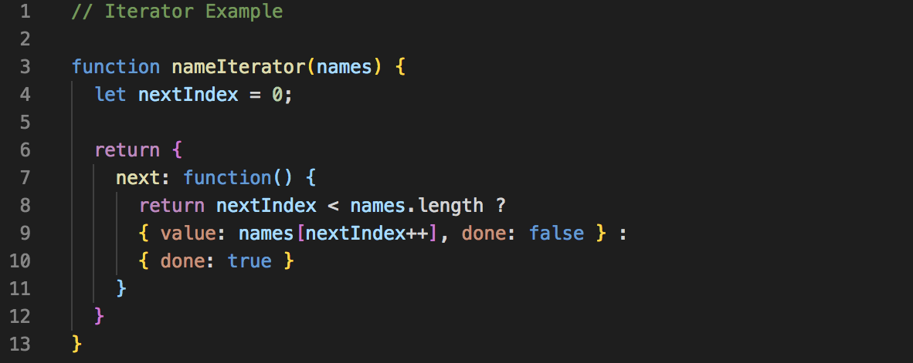</kbd>

Next, let's go ahead and use the Iterator function example we created.

<kbd>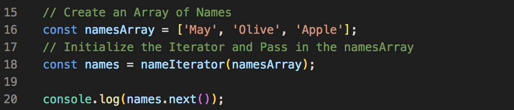</kbd>
<kbd>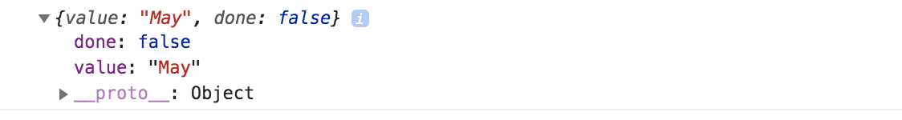</kbd>

With `.value` added, it's iterating through the array, `namesArray`:

<kbd>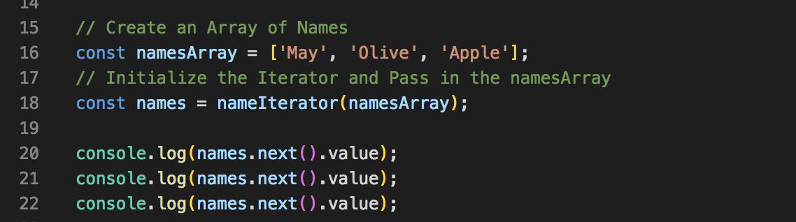</kbd>
<kbd>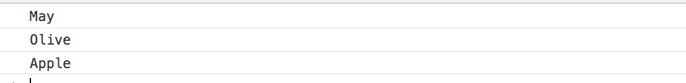</kbd>

If we iterate all the way through, the object return will switch to `true`:

<kbd>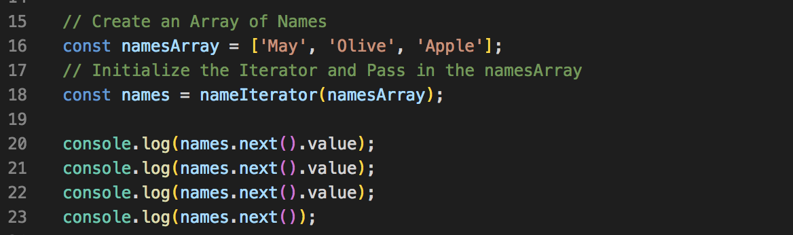</kbd>
<kbd>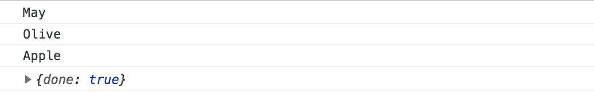</kbd>

With this example, it's difficult to wrap your head around how'd you'd use this **Iterator Function**, but we'll create a project later to see how it can be used.

## Generator Example

They're functions that can return multiple values, also known as, **yield values**.

* Create a function called `sayNames()` with an asterisk `*` after the word `function`, that's what makes a **generator function**. The `*` tells JavaScript that it's a generator
* In the function, we can do anything we want and we can `yield` values from it.
* Next, we need to assign a variable to the generator

As you can see, we got the similar response print like in the Iterator function example when we made the first call.

<kbd>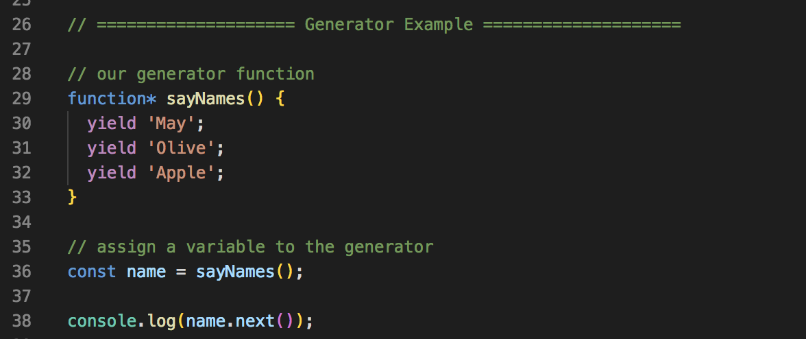</kbd>
<kbd>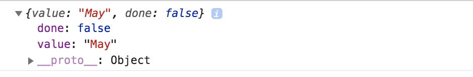</kbd>

If we want to just get the value, we'd just add `.value` as well:

<kbd>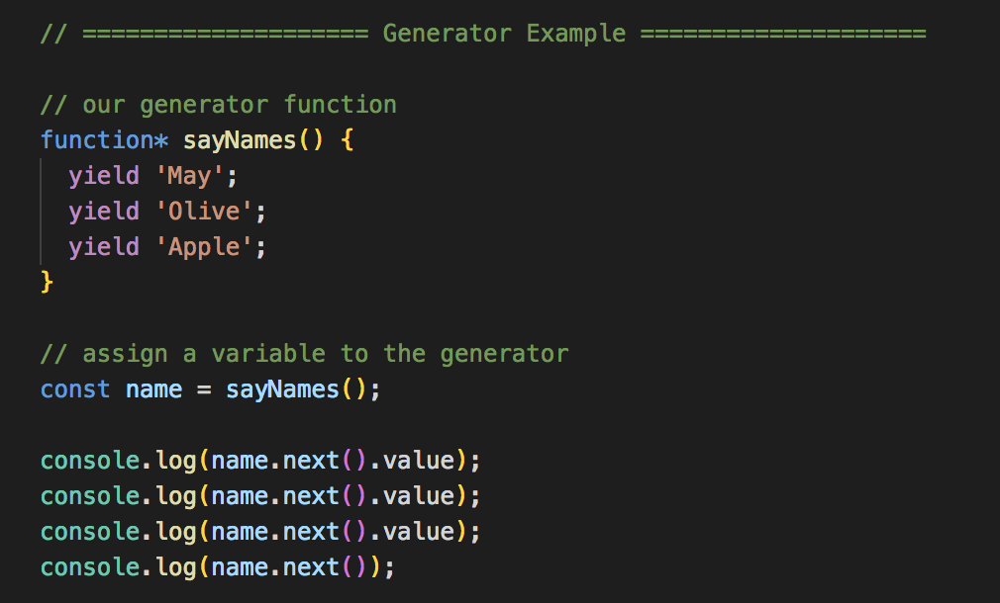</kbd>
<kbd>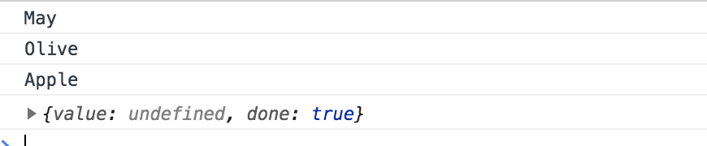</kbd>

## Generator Example to Create IDs

<kbd>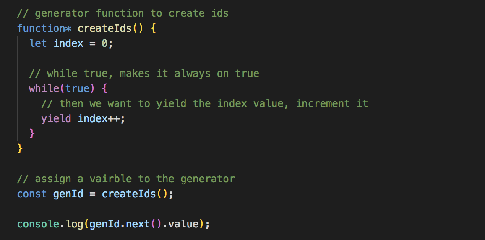</kbd>
<kbd>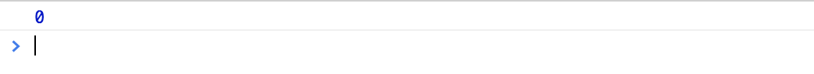</kbd>

See how it increments:

<kbd>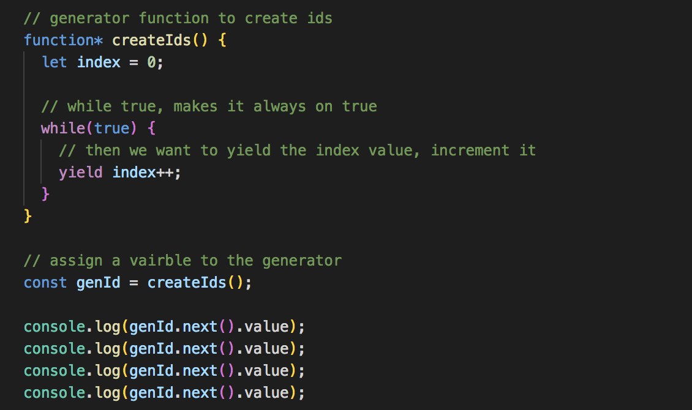</kbd>
<kbd>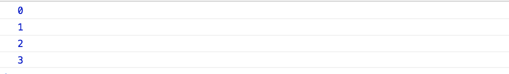</kbd>

This is an example of what we can do with **generators** like continue to create ids.