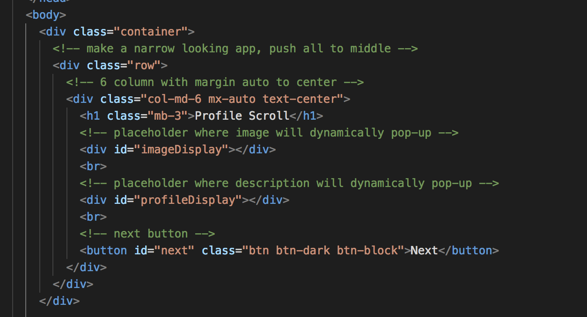
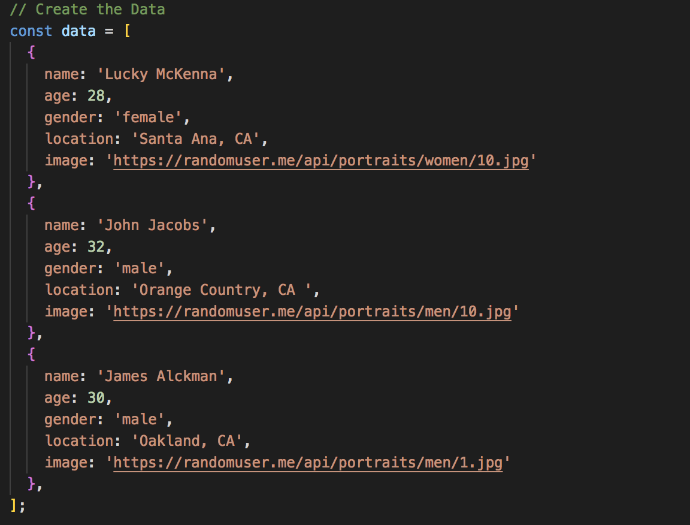
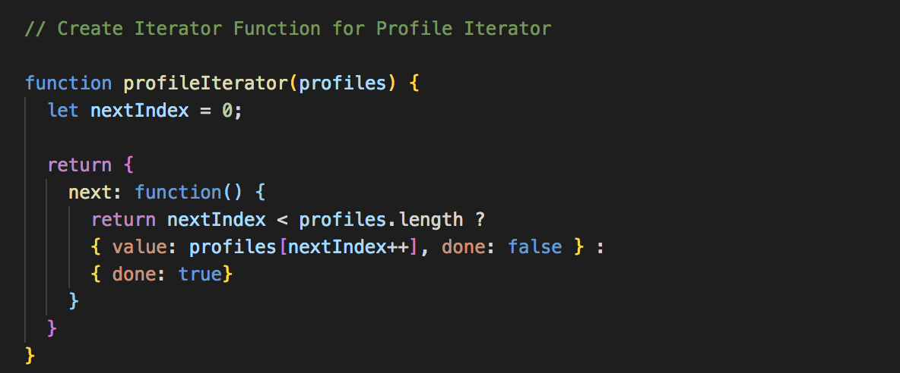
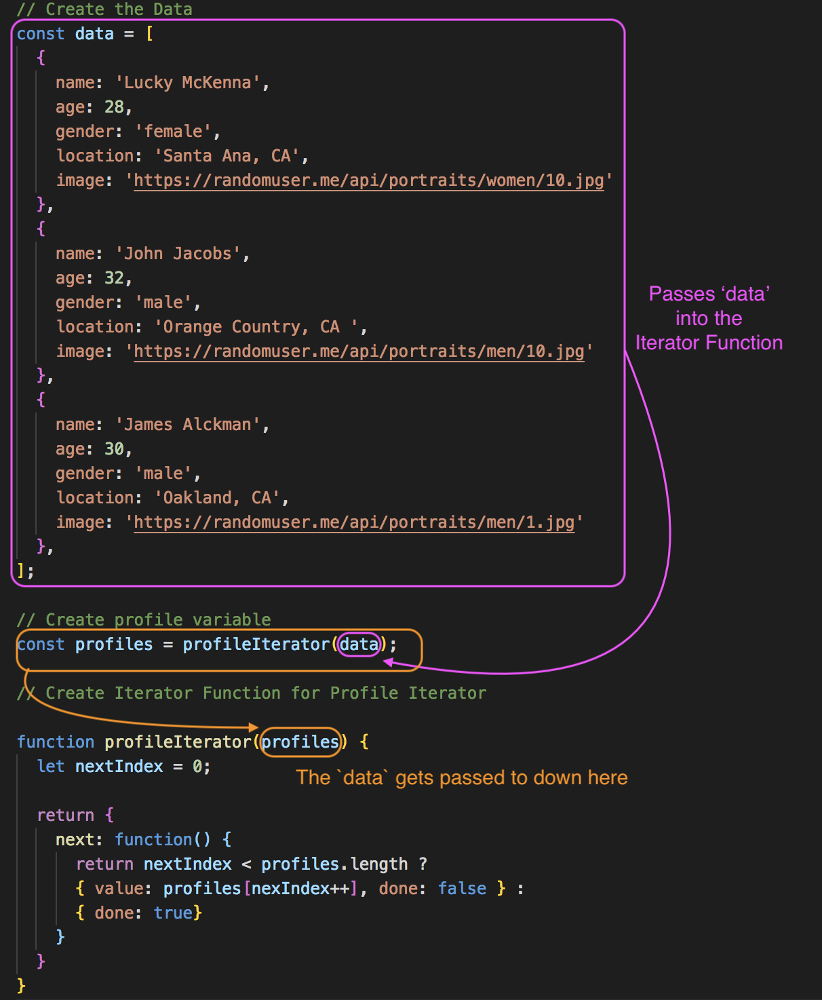
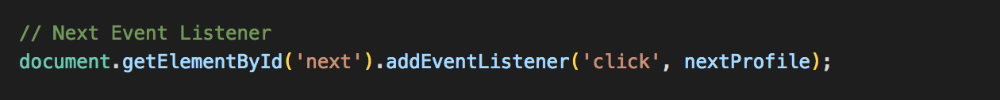
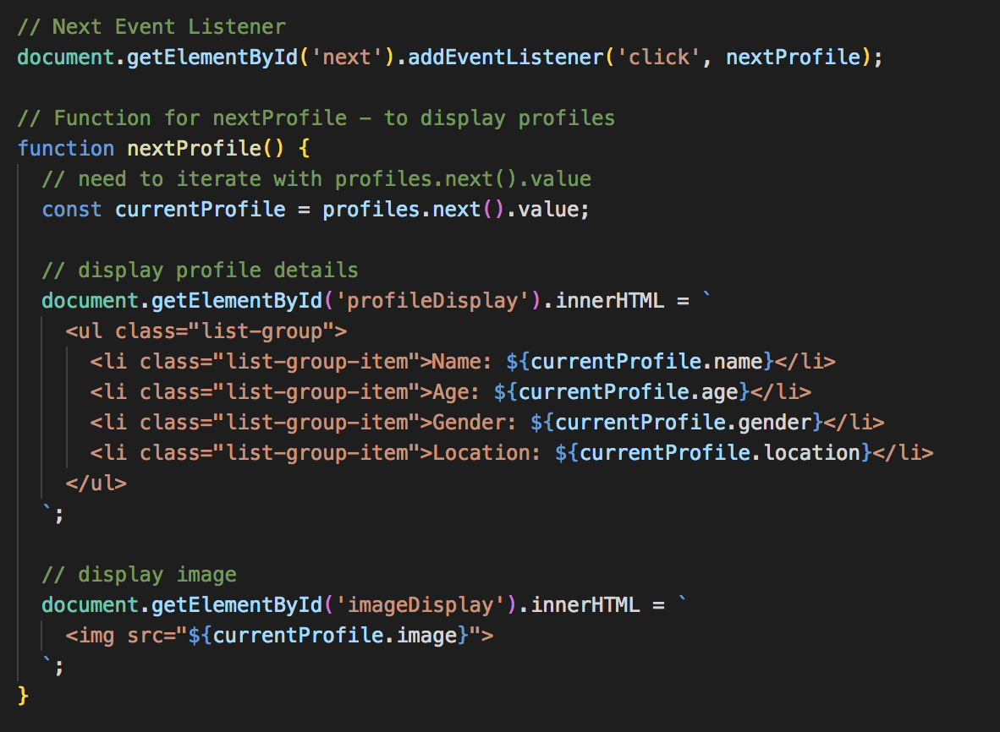
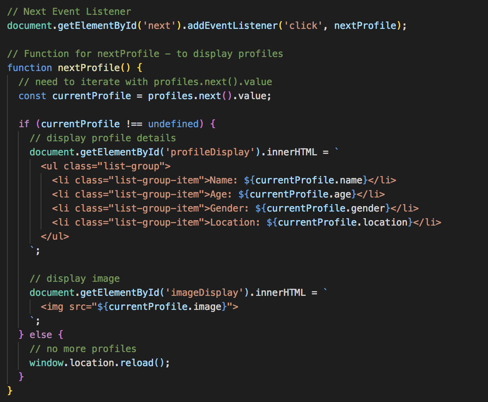
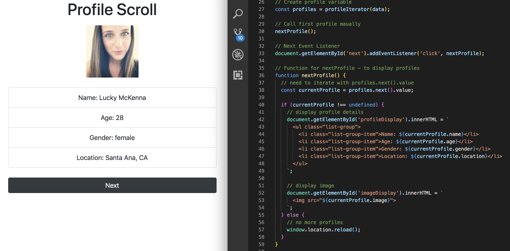

# Iterator Mini Project - Profile Scroll

We're going to build a Profile Scroller project using a JavaScript **ES6 Iterator**. 

Since ES6 Iterator and Generators have come, it's been kind difficult for folks to know how to use it an an actual project, so this is one example, having it integrated with the DOM. 

It'll be a Profile Scroll, like what you'd see in a dating site. Like a picture of someone with some info, click next to go to the next profile and so on with **ES6 Iterator**.

## Setup HTML file

We're using Bootstrap 4 here to help us make UI look nice :)

<kbd></kbd>

## Setup JS file

* First create the **data**. Usually, the data will come from an API, or some kind of backend, but this time, just hard coded. For the image part, use the API called **random user**.

<kbd></kbd>

* Create Iterator function and its going to take in one argument, which will be the data we created above `function profileIterator(profiles) {...}`
* Inside, it we want to create a variable called `nextIndex` and initialize it to `0`.
* Then, we want to `return` and `{...}` with the `next: function() {...}` and inside that, `return` of either the `value` and false or `done` with true.

<kbd></kbd>

* Above the function, under `data` we created, make another variable and call it `profiles` and set it to the `profileIterator()` function and pass in the `data`.

<kbd></kbd>

Next, we need to create a **click event** for the `next` button on our UI. When we click the Next button, we want to iterate through the profiles.

* Need to get the element by the id `next` and add event listener on `click`, it's going to run the function `nextProfile` (we will need to create the function of `nextProfile`).

<kbd></kbd>

* Inside the `nextProfile()` function, we need to need to grab the ids of `imageDisplay` and `profileDisplay` from html file bc that will be where we'll dynamically put the content.

<kbd></kbd>

### We need to fix the error, for continual click, if data ends

To handle this, wrap the DOM code in an `if-statement`, if the data is done.

* `if (currentProfile !== undefined)` then display and load the next person.
* Otherwise, just reload the page `window.location.reload();`

<kbd></kbd>

### Now, fix the first profile to load first automatically

* Hard code it above the Event Listener with `nextProfile();`

Now, it kinda just loops through.

<kbd></kbd>