# ES6 Symbols

The neat thing about symbols is that every single one is completely unique, which makes them very valuable in terms of things like **object property identifiers**, and this is the main purpose of symbols - their uniqueness. 

* `Symbol()` is an actual primitive value like, `const sym1 = Symbol()`
* You can also add an identifier inside of the Symbol() like, `const sym2 = Symbol('sym2')`

<kbd>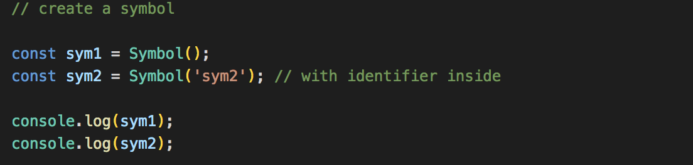</kbd>
<kbd>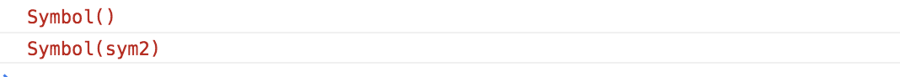</kbd>

* If you want to look at the type, use the `typeof` operator in the call. This tells us that it's a primitive data value because it doesn't return the type as object, it's just a pure primitive value type.

<kbd>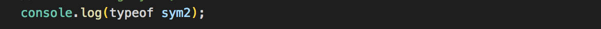</kbd>
<kbd>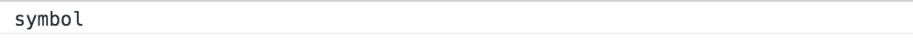</kbd>

Remember, `Symbol()` could never equal the same, even if you have the same identifier inside it.

## The Main Reason For Symbol is the Unique Object Keys

<kbd>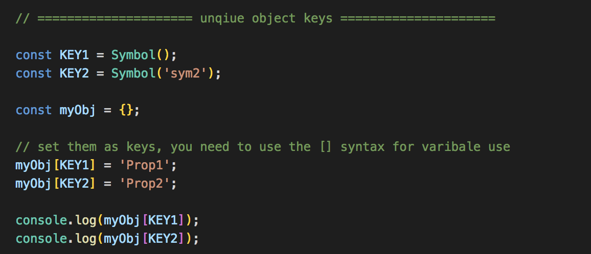</kbd>
<kbd>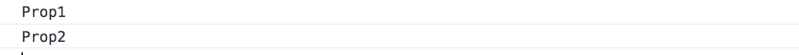</kbd>

## Things That Work Different for Symbols

### Doesn't work with for...in loops

If we were to loop/iterate through `myObj` using `for...in loops`, then it wouldn't actually show up in the iteration because they're not enumerable `for...in loops`. For example:

<kbd>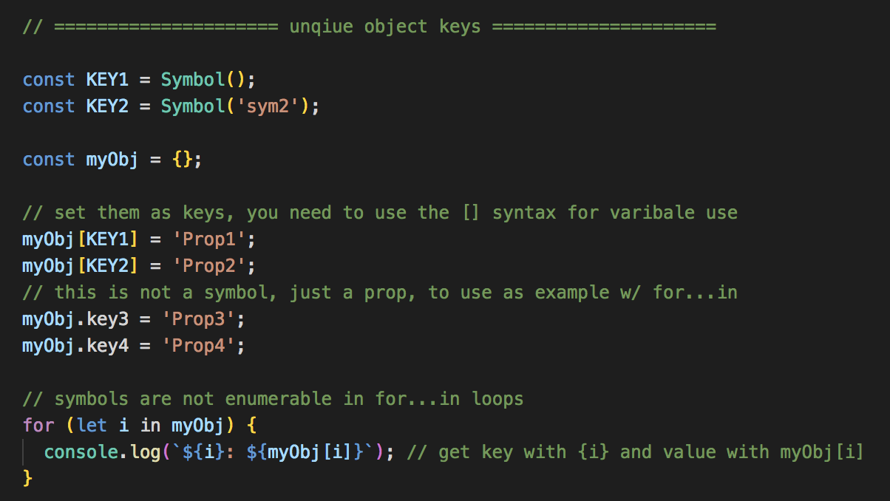</kbd>
<kbd>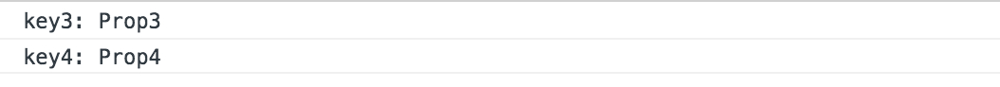</kbd>

Notice that you only get `key3` and `key4`. The first two didn't show up because `Symbols()` are not enumerable to `for...in loops`.

### Symbols are ignored when using JSON.stringify

Remember, `JSON.stringify` takes JavaScript's Object Literal and turns it into a json string.

<kbd>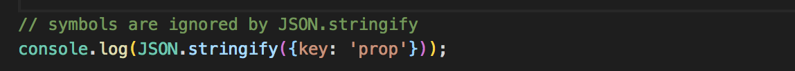</kbd>
<kbd>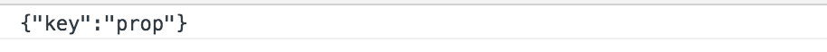</kbd>

Notice that it prints it as a JSON string.

<kbd>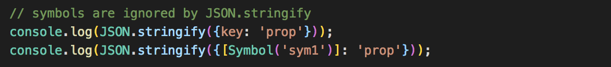</kbd>
<kbd>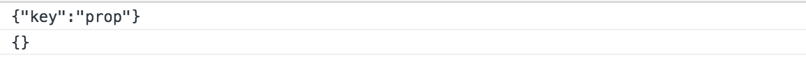</kbd>

You'll see that it ignores `Symbol()` and just prints an empty object. It doesn't actually parse like the previous example.