# Destructuring

This was introduced in ES6 and it gives us an easy way to assign variables and extract variables from Arrays and Objects. If you've ever used frameworks like **React**, then you've probably used destructuring before. Not just frameworks, but any kind of **Modularized JavaScript**.

Since we're not using Modules, we're gonna hard coded data in the same file in this example.

## Looking at Desctructuring Assignment with Arrays

* Let's say we want to create a variable like `a` and `b` and initialize it with nothing.
* Then, set some brackets and say `[a, b]` ans set it equal to an array of `100` and `200`.

<kbd>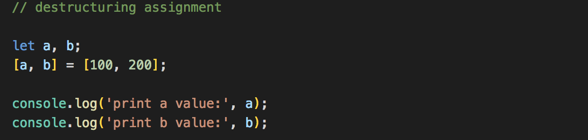</kbd>
<kbd>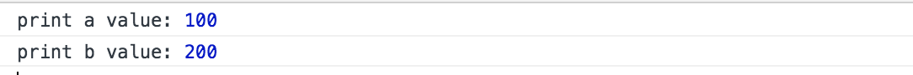</kbd>

Another way to do it is the **Rest Pattern**. It's going to assign whatever that's left over, into an array into a variable called `rest`.

* Use the `...` spread operator with `rest` and assign to more values.

<kbd>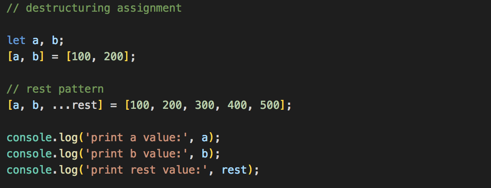</kbd>
<kbd>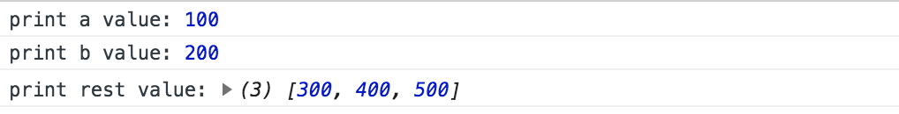</kbd>

## Looking at Desctructuring Assignment with Objects

<kbd>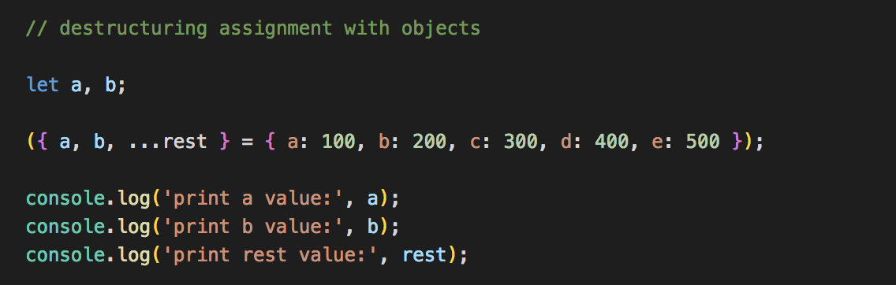</kbd>
<kbd>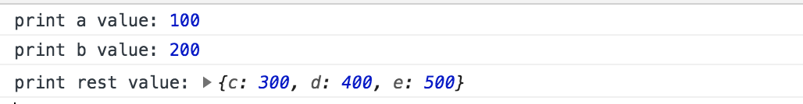</kbd>

## Array Destructuring

Example with simple Array:

<kbd>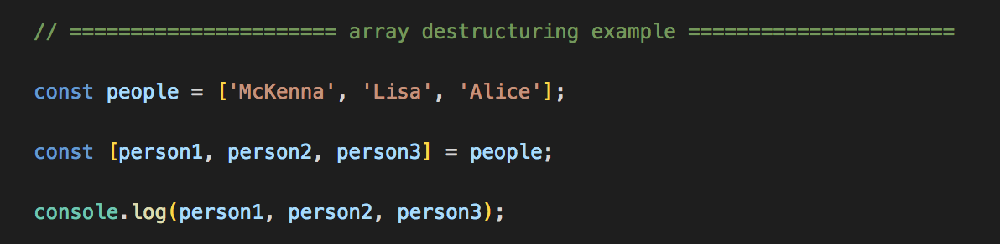</kbd>
<kbd></kbd>

Example with Array that was returned from a function:

<kbd>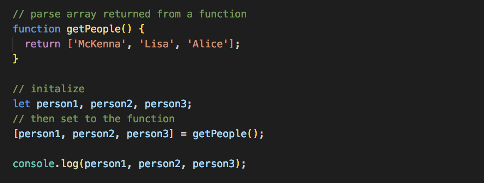</kbd>
<kbd></kbd>

## Object Destructing

When you're working with **React** or other frameworks with ES6 modules, you're usually going to deal with **Object Destructuring**. You might have some kind of library module, where you're exporting an object, but you want to get certain functions from that object or certain properties from that object.

* Let's create an object called `person` with properties.

<kbd>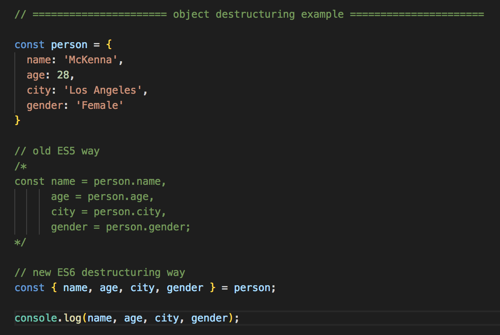</kbd>
<kbd></kbd>

As you can see, the ES6 version is a lot cleaner than the old ES5 version.

* If we have a function in our object:

<kbd>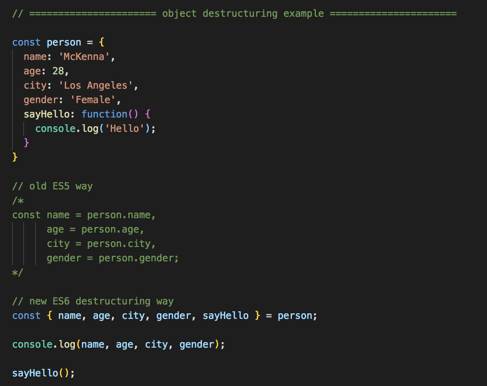</kbd>
<kbd>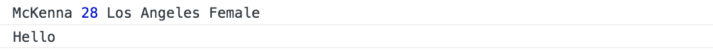</kbd>