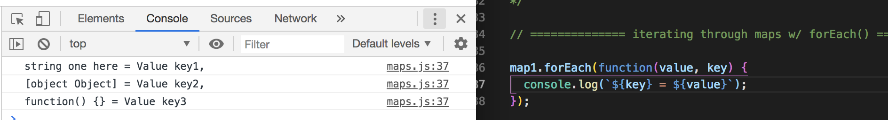

# ES6 Maps

Maps are a new Object structure introduced in ES6.

* **Maps** - is an object that holds key value pairs.

Whether it's an object reference type or primitive, it can be used as a key or value. It's very different than just an Object Literal. Here, we can actually use an Object as a key.

## Their Key-Value Pairs

There's different ways we can iterate through them and they're actually pretty interesting. Here's what I mean:

* Create a variable called `map1` and set it to `new Map()`
* Then, set some **keys**, each variable set to different value types like a string, object, function, etc. Looks pretty weird, but we'll see how they work thanks to `Maps()`
* Next, set map **values** by key like, `map1.set(key1, 'Value of key1 here')`
* Test by printing with console.log, we get it by using the `get()` method and then pass in the key
* You can also **count the values** inside of the map, the total of key-value pairs

<kbd></kbd>
<kbd></kbd>

## Iterating Through Maps with For...Of

* We can use the **for...of iteration**
* We can get either the **key**, the **value**, or **both**
* In this example, we'll get both the keys and values

<kbd></kbd>

Iterating to get both key-value, only key and only value:
<kbd></kbd>

## Iterating Through Maps with forEach()

* Call the object, like `map1` and add `.forEach()` and then pass in a function to do what you want out of iterating through the object.

<kbd></kbd>

## Convert Object Keys to Arrays

Another thing you can do is convert keys to arrays.

* Let's say we want to create an array of key-value pairs.
* First, create a variable, let's call it `keyValueArray` and set it to `Array.from()` - remember we used `Array.from()` when worked with the DOM, with array collections - and then pass in `map1`.
* Then, print out the array.

<kbd></kbd>

You can also create arrays just from values.

<kbd></kbd>

You can also create arrays just from keys.

<kbd></kbd>

So, that is the basics of how `Map()` works :)