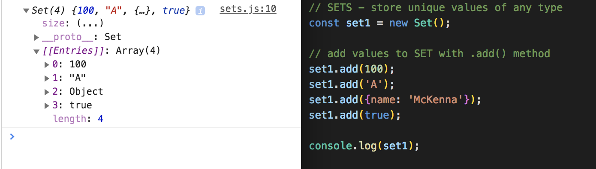
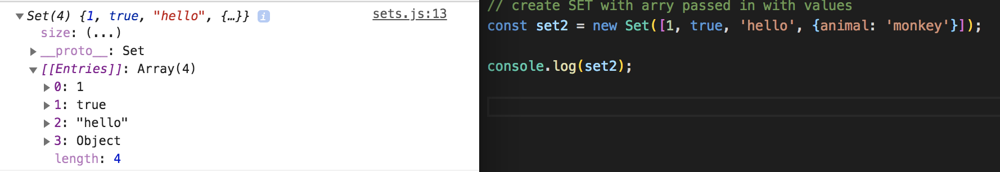
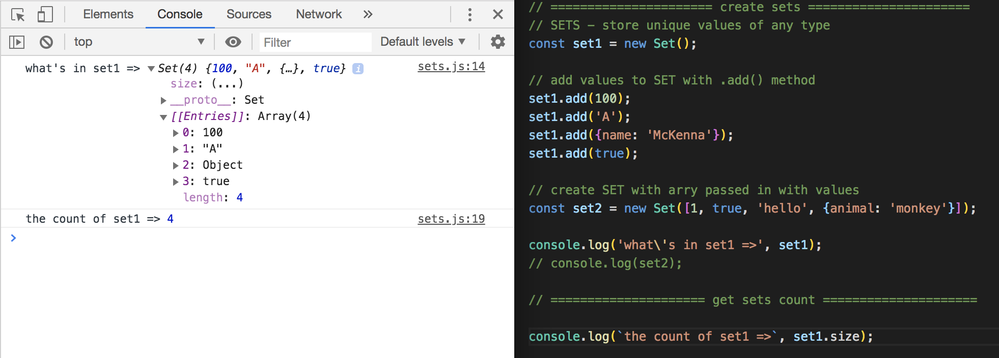
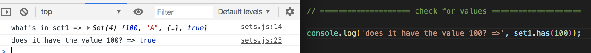
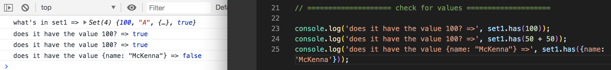
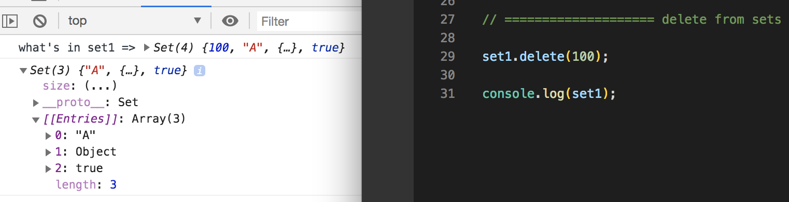
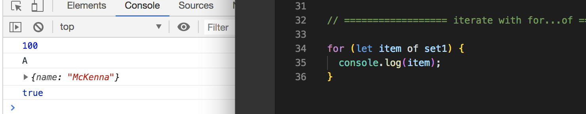
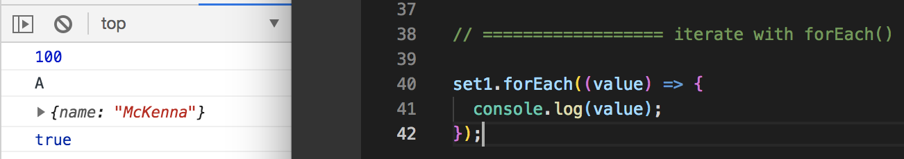
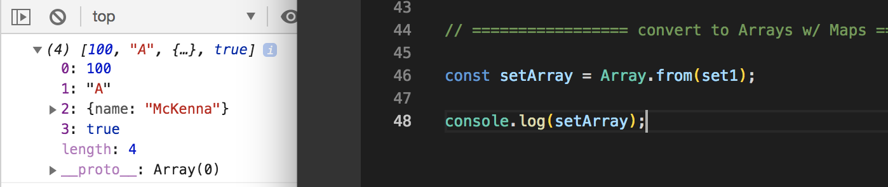

# ES6 Sets

**Sets** are basically unique values in a set of any type, whether it's primitive or reference.

* Create a set like `const set1 = new Set()`
* Add values to the set using the `.add()` method

<kbd></kbd>

If you tried to add a value of `100` into the set again, it's not going to include it.

* You can also create a set by using an array instead

<kbd></kbd>

## Get Count

To get the count of set, use the `size` property - same as what we did with map

<kbd></kbd>

## Check for Values

To see if there's a value you're looking for, us the `.has()` method:

<kbd></kbd>

You can do an expression like `50 + 50` and it'll pass bc it adds up to `100` and it'll pass as `true`.

However, with an Object, it doesn't work, it's `false`, the reason why is because it's a reference object, it's not a primitive value that you can actually store in the stack, it's stored in heap, which makes it a reference value, it's just pointing to a point in memory. It's not a primitive type.

<kbd></kbd>

## Delete from Set

Using the `.delete()` method, you can remove values from the set.

<kbd></kbd>

## Iterate Through Sets with For...Of

<kbd></kbd>

## Iterate Through Sets with forEach()

<kbd></kbd>

## With Maps, Convert Sets to Arrays

<kbd></kbd>

## Summary

This is just another option of Object Structure with ES6+. Hopefully this helps explains what a Map and a Set is.