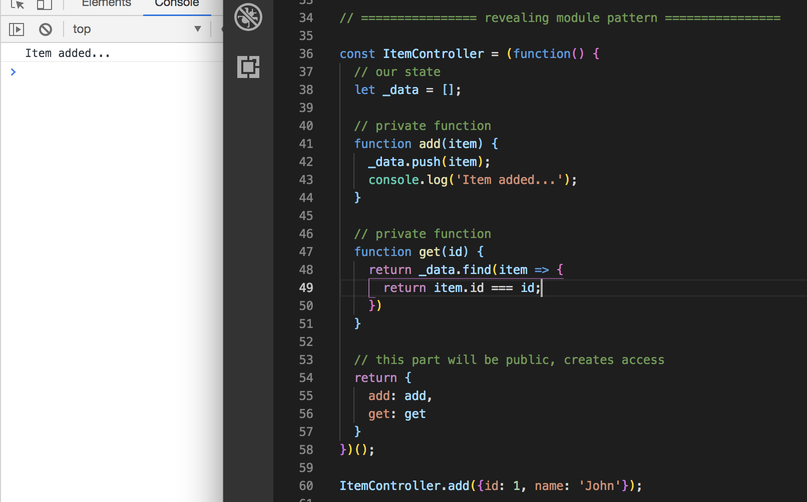

# Module & Module Revealing Pattern

ES6/ES2015 actually introduced actual modules in JavaScript meaning that we can use separate files to export modules, which are just custom pieces of code and import them into a new file. However, this is still not supported in browsers, so you'll have to use a compiler like **Babel** along with a module loader like **WebPack** for that to work (we'll learn this later).

With ES5 Module Pattern allows us to break-up parts of our code into self-contained modules with private variables and functions.  

# How Module Pattern Works

We'll learn about the Basic Structure with a Module that's going to be an **iffy**, which is an immediately invoked function expression, meaning it runs right away. You'll write a function inside a set of `()` and you'll invoke it with another set `()` at the end - so the first `()` has the function and the the second one invokes it.

The idea of the Module Pattern is to declare `private variables and funtions`. What we mean by private is that we can't access it outside the module. Below the decalre private var/function, we return it with where we declare `public var and functions`. This is the blueprint for the module patterns.

**Basic Structure of Module Pattern**

<kbd></kbd>

Next we'll setup another module called `UIController` - set it as a module and again, it's an `iffy`. Again, anything declared at the top above the return statement, create a variable called `text` and set it to the text of `Hello World`. Then, all we have after it is a function that will change the `<h1>` heading from our HTML file to whatever that's in our `text = 'Hello World'` variable.

To do that, create another variable called `changeText` and set it to a function expression, with `const element` to grab the `<h1>` with `document.querySelector` and grab it by the tag `('h1)`. Then, say `element.textContent` and set it to `text` which is 'Hello World'.

At this point, both of these are private variables and functions. We can't access them outside the `UIController` module. So again, we need to `return` something from this module, like in the previous blueprint example.

In our `return` create a function called `callChangeText` and set that to a function and then run `changeText`. 

**We're gonna change the `h1` from this...**
<kbd></kbd>

**to Hello World and also `console.log` it**
<kbd></kbd>

Again, you can only access the private varibale or function from inside the Module via the return.

# How the Revealing Module Pattern Works

It's very similar to the Module Patter, but instead of returning our own public functions, instead, you'll `Map` an Object Literal and you'll map to private functions that you want to reveal. That's why it's called the Revealing Pattern because you can reveal certain methods from your module.

In this example, we'll do something like a database controller, call it `ItemController` and set it to an `iffy`. Create a variable `data` and set it to an empty array, this is our **state**. Then, we'll create `private` methods like `add` and pass in `item`. It'll take in the `data` array and we'll `push` onto it that `item` that's being passed in. We can do a simple print with `console.log`.

A lot to time, with private variables, you'll we an underscore like `let _data = []`

Create a function called `get()` and it's going to take in an `id` and return the `data` and use the `find()` method and pass in an `item` and `return item.id` if it's equal to the `id` that's passed in.

Right now, `add` and `get` functions  are completely private.

Below, we're going to `return` an Object Literal with `add` and set it to `add` like `add: add`.  Same goes for `get`. This part basically reveals the methods above.

Then outside the Reveal Module, we can call `ItemController` with `add()` and pass in an object with info.

<kbd></kbd>

<kbd></kbd>