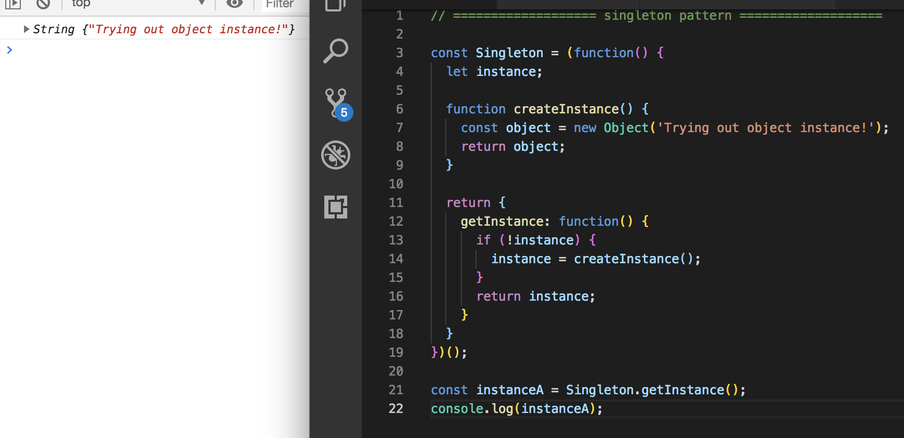
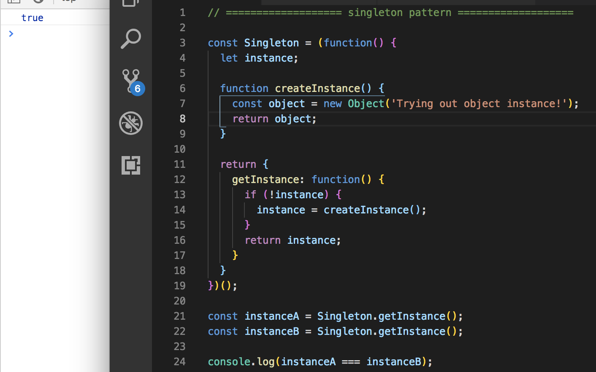

# Singleton Pattern

A **Singleton Pattern** is an immediate anonymous function and it can only return one instance of an object at a time. So, a repeated calls to the `constructor()` will just return the same instance.

Like the Module Pattern, it maintains a **private** reference, which nothing from the outside can access.

## Why Use Singleton Pattern

Why you would want to use a Singleton Pattern is for instance, when you only want one user created at a time. Like making a Login feature would prevent you from having two users from being created at once.

## Why Singleton Pattern is Not Popular

Often times, Singleton Patterns are not liked because they give you a **global point of access** rather than embracing encapsulation, which bothers a lot of programmers. They can also be hard to debug.

We should know and learn about this pattern though because it's a relevant pattern to many other programming languages in general.

## Practical Example of Singleton Pattern

* Create a variable called `Singleton` and set it to and **iffy** `(function(){...})();`
* Next, create a variable called `instance`
* And then make a function called `createInstance` and inside it create a variable called `object` and set it to a `new Object()` and pass in a string just to try it out
* Then, `return` that object inside the `createInstance` function
* Like the previous Module Pattern, we need to do a `return` and do something like create a `getIntance` property with a function that does something like if there's no `instance` then we want it to be equal to `createInstance` and under the if-statement, we want to return the instance
* Outside of the **Singleton**, we need to instantiate an object 

**We get a string and it's a primitive object instance**
<kbd></kbd>

If you instantiate another object from the Singleton, you can never get another new value, it'll just give the same instance again.

<kbd></kbd>