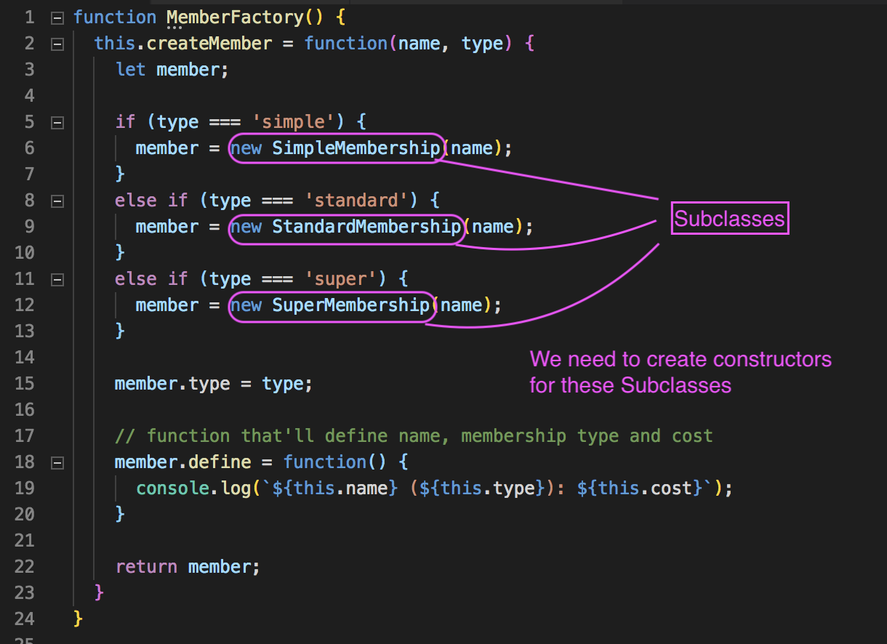
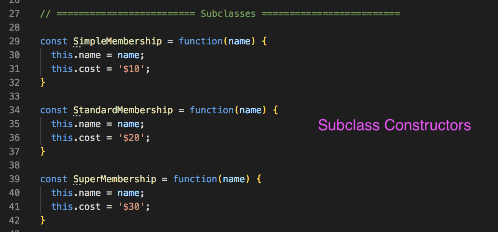
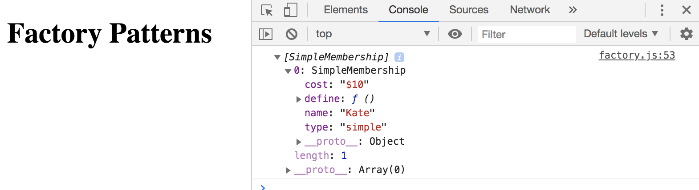
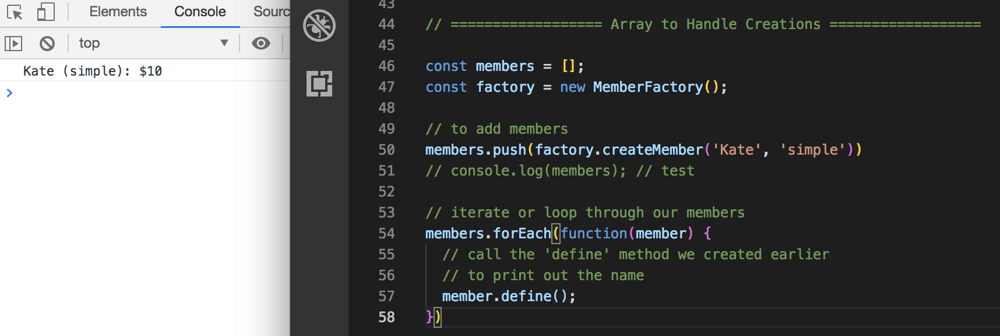
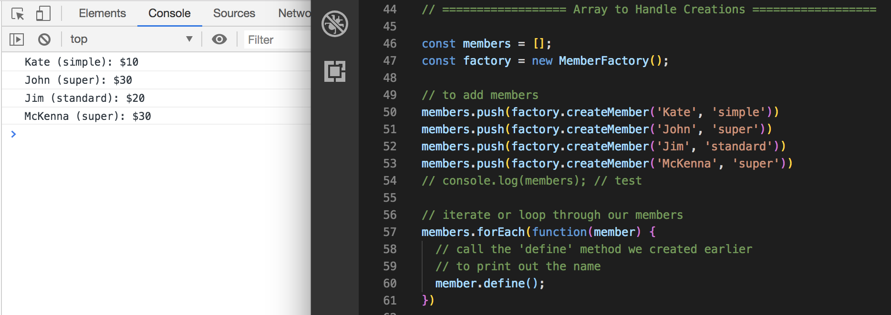

# Factory Pattern

The **Factory Pattern** is also called **Factory Method** in JavaScript, which is a way of creating an interface for creating Objects, but we can let **subclasses** define which classes to instantiate.

They're often used in applications to manage, maintain and manipulate a collection of objects that are different, but at the same time, have many common characteristics. A good example of this would be a *Paid Membership* application, where your memebers may have different types, but still have the same properties and methods.

So in this example, we're going to create a simple Member Factory that takes a *member type* and creates a new Object based on that type.

## Member Factory Example

* Create a function and call it `MemberFactory` and have `this.createMember` assigned to a function expression and it'll take in two things `(name, type)` the name and membership type.
* Inside the function expression, we want to check the `type` that's passed in and based on that type, we want to create a new certain type of object depending on the type of membership (standard or super memebership) like for a webhosting application website.
* If membership is `simple`, then instantiate `SimpleMembership` and pass in the `name`.
* Else if, is it is `standard`, then instantiate `StandardMembership` and pass in the `name`.
* Else if, is it is `super`, then instantiate `SuperMembership` and pass in the `name`.
* So, in the **if-statement**, we're testing out whatever the `type` is.
* Afterwards, we want to set the `member.type` equal to `type`.
* Then, create a function/method associated with this object called `define` and it'll spit out the `name`, `membership type`, and `cost` of the membership.

<kbd></kbd>

## Constructor for Subclasses for Member Factory

* Create a variable and for each Subclasses and a set it to a function.
* That function will take in a `name` passed in.
* Set `this.name` to the `name` that's passed in.
* Then, set the `cost` to whatever dollar price range.

<kbd></kbd>

## Arrays for Members

* Create a variable for `members` and set to an `[]` array.
* Then, create a variable to make new members with `new MemberFactory()`.
* To add members, `members.push(factory.createMember('Kate', 'simple'))`.
* Test it out with `console.log(members)`

<kbd></kbd>

* Loop through `members`

<kbd></kbd>

* Let's create more members and see what more of how our `define` method works when there are more members.

<kbd></kbd>

## Summary on Factory Pattern

It's really good when you have different Objects, but also shares a lot of the same properties and methods. In this example, it was different memberships. 