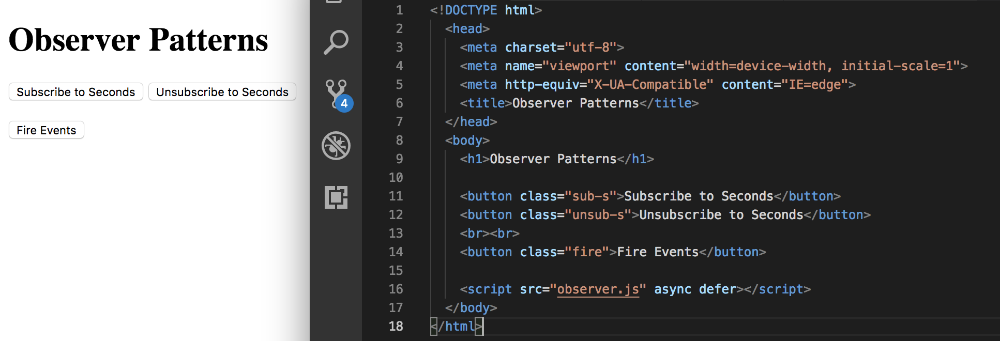
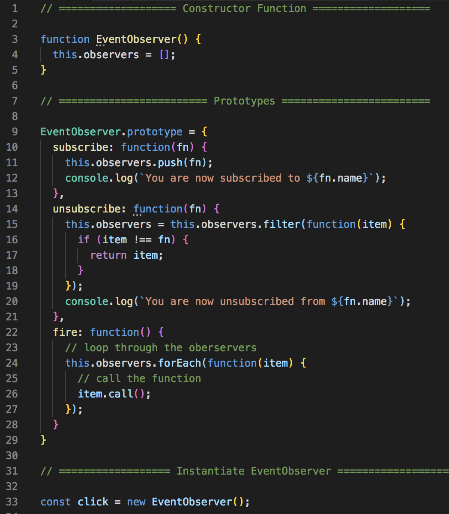
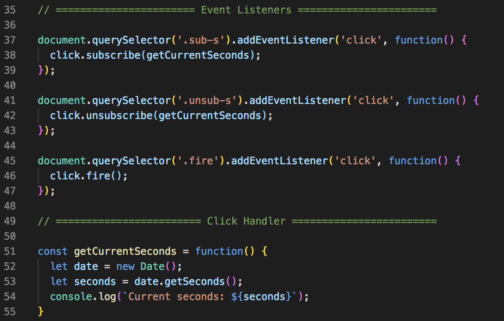
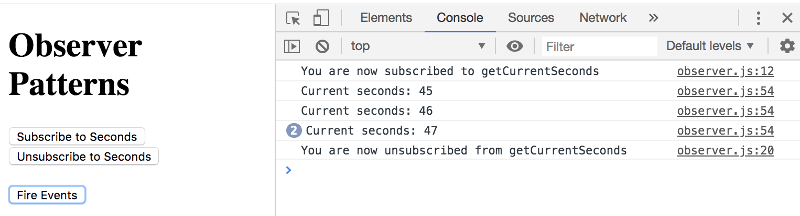
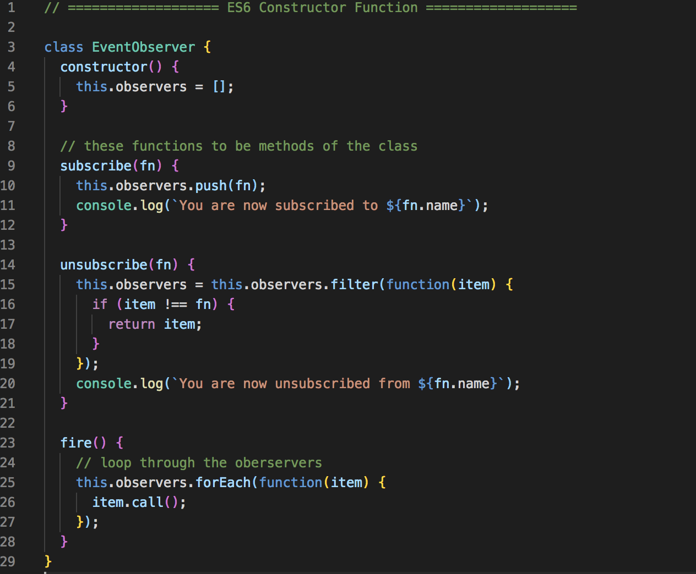

# Observer Pattern

It allows us to subscribe and unsubscribe to certain events or certain functionality. So, it gives us a nice subscription model.

This is one of the more interesting patterns because it can be used to notify the DOM of certain elements to be updated (**Angular JS relies heavily on Observer Pattern through Event Management within the Scope**).

* Our first example we'll be using **Protoypes** 
* Second example is with **ES6 Classes**

## HTML File

We'll create button that will allow us to subscribe and unsubscribe to certain **click events**. In our HTML file, we need to create some simple UI.

* Create a `<button>` element with class of `class="sub-s"` which will subscribe/unsubscribe to a **click event** to get seconds, to print out the current second using the date method.
* Second, create a `<button>` element with class of `class="unsub-s"` which will subscribe/unsubscribe to a **click event** to get seconds, to print out the current seconds using the date method.


<kbd></kbd>

## JS File - Constructor and Instantiation

* Create a **constructor** function called `EventObserver` and it'll have one property called `this.observers` which represents the functions that will be passed into it, it'll be an array.
* Underneath that, create **prototypes** with `EventObserver.prototype` and set it to `{ subscribe }`, putting it all into an object. Another way is just ``EventObserver.prototype.subscribe`. Each one will be a function and it's going to take in a function and push it on to `observers` and pass in `fn`.
* Test it with `console.log()` just to notify the user that they've subscribed.
* For `unsubscribe` set it to a function and pass in `fn` for function and set `this.observers` equal to `this.observers.filter()`
* We're basically mutating `this.observers.filter()` by calling callback function inside `.filter()`
* Then inside the callback, do an **if-statement**, if `item !== fn` the function `fn` that's passed in.

Filter out from the list whatever matches the callback function, If there is no match, the callback gets to stay on the list. Then the filter returns a new list and reassigns the list of observers.

So, if you're unsubscribing from a certain function, that one will be removed, but it'll generate a new list that has the rest of the functions.

<kbd></kbd>

## JS File - Event Listeners

```
document.querySelectore('.sub-ms').addEventListener('click', function() {
  click.subscribe();
});
```

* On a `click` event, we want to take the function, the click object and call the `subscribe` method in `EventObserver.prototype = { subscribe = function...}` as `click.subscribe()` and that takes in a function `fn` above to subscribe to.
* We need to create that for `fn`.

<kbd></kbd>
<kbd></kbd>

## Summary of Observer Pattern

So this is what the Obserer Pattern allows us to do, although this is a simple useless example. Try to think of ways of how you can use this pattern in a useful way.

## ES6 Version

You don't need to create a Prototype Object. It just becomes methods inside the class constructor.

<kbd></kbd>