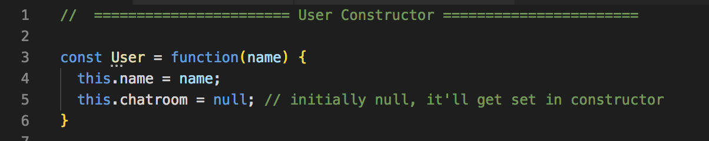

# Mediator Pattern

It's another behavior pattern like the Observer. The idea is to have an interface for communicating with what are called colleagues, which are just mediated objects. One of the best example of this are **chatrooms**.

This example isn't going to be a full project, but it could be implemented with **Socket.io**.

We're going to have two **constructor functions**.

* Constructor function for User = colleagues to chatroom
* Constructor function for Chatroom = mediator

The idea is to be able to have users that can send messages to another single user or to broadcast to the entire chatroom. Again, the **chatroom = mediator** and the **users = colleagues of the chatroom**

## User Constructor - The Colleague

<kbd></kbd>

## Prototype - Object Oriented

<kbd></kbd>

## Chatroom Constructor - The Mediator

<kbd></kbd>

## How to Use Our Pattern

<kbd></kbd>