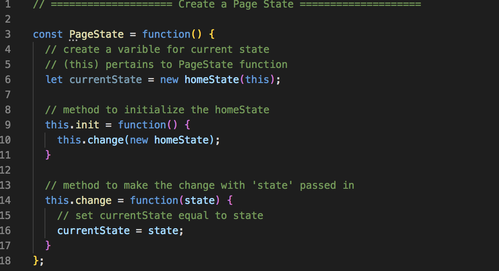
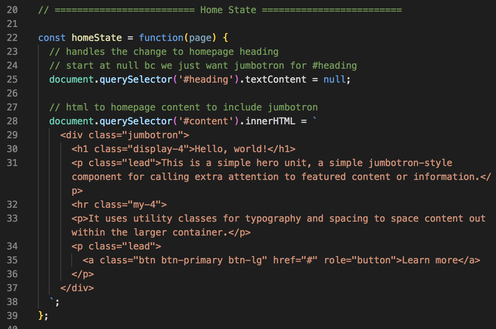
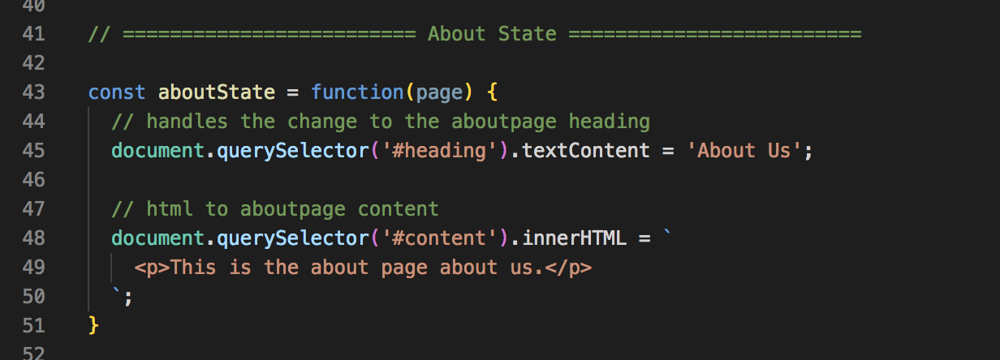
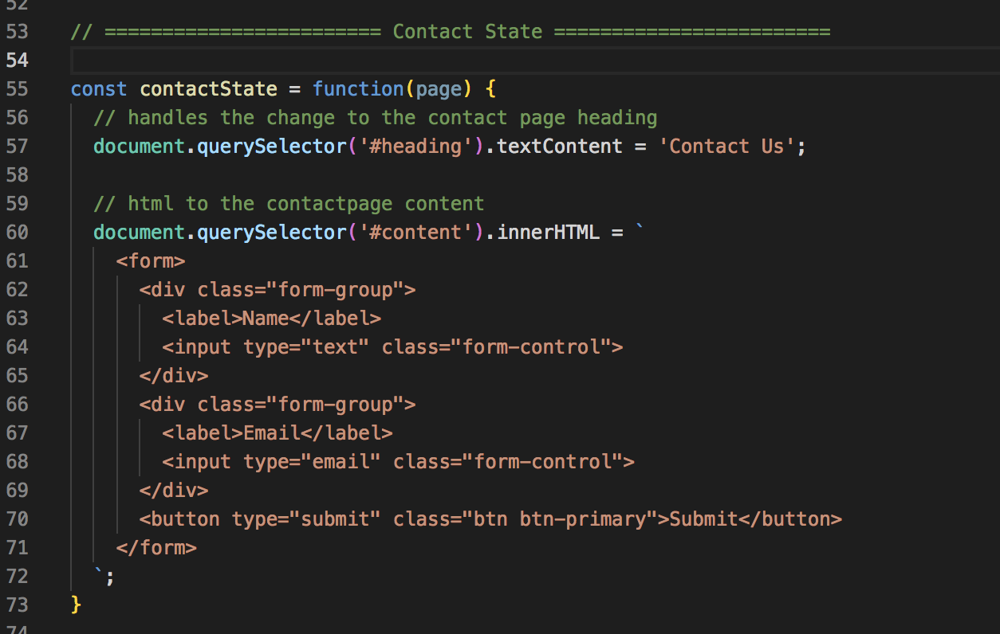
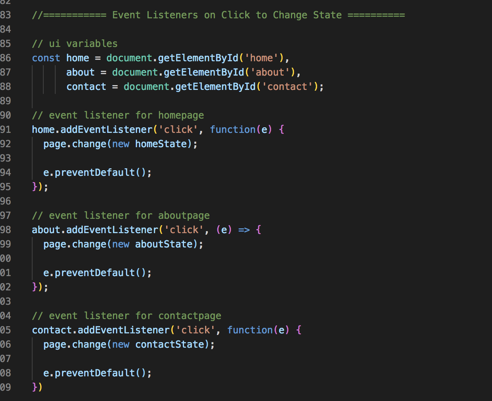

# State Pattern

It's another Behavioral Type Pattern. It's kind of like how **state managers like Redux** works.

Simple example to see it works, not a very practical example. But, just to show how everything can be done in JS and not in multiple HTML files.

## Create Page State with Two Methods

<kbd></kbd>

## Home State 

<kbd></kbd>

## About State

<kbd></kbd>

## Contact State

<kbd></kbd>

## Instantiate

<kbd></kbd>

## Event Listeners

<kbd></kbd>