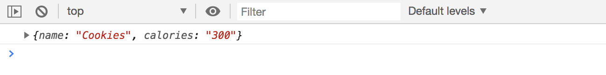

# JavaScript Module Pattern Project - Meal and Calorie Tracker Project

A simple single page app in terms of functionality. Building this project in pure JavaScript and Module Pattern. No libraries, no jQueries, no framework, no build tools. We'll be using **ES6 features** like template literals and template strings, let and const, forEach(), modern JavaScript to build this application. Use Materialize CSS for the UI, that's it.

* Use JavaScript Module Pattern
* Use Local Storage to persist the data

Use a few different Module Controllers

* Storage Controller for Local Storage (the last thing to do)
* Item Controller to handle the actual data, the state
* UI Controller to handle the UI (for showing and hidding things, getting input values)
* Main App Controller, the initializer

How it works

* You can add an item for meal and calories
* When item is added, it gets added to a list and total calories
* When you reload, data stays bc it's persisted to the Local Storage
* You can update the item as well, it'll change the state to an edit (update, delete and back buttons)
* A button to clear all

## Build UI

* Materialize CSS CDN
* Font Awesome CDN

### Navbar

<kbd></kbd>
<kbd></kbd>

### Meal Form

<kbd></kbd>
<kbd></kbd>

### Buttons for Meal Form (Add/Update/Delete/Back)

<kbd></kbd>
<kbd></kbd>

We're going to comment ount the **update and delete buttons** because we're going to have JavaScript generate it later.

<kbd></kbd>

### Total Calories Count

Should still be in the div container with the rest.

```
<h3 class="center-align">Total Calories: <span class="total-calories">0</span></h3>
```

### Meal / Item List

Will also still be in the div container. Start off with a `<ul>` and give it and id and class. First hardcode them into the html file, but we'll have JavaScript generate it later. Just get the markup laid out, so we know what we have to insert.

```
<ul id="item-list" class="collection">
  <li class="collection-item" id="item-0"></li>
</ul>
```

For the `<li>` we need to give it an `id`, each item will have it's own `id` incremented as added.

<kbd></kbd>
<kbd></kbd>

We'll comment out the `<li>`, these are just hardcoded as templates. We'll have JavaScript generate it later.

## JavaScript File - Module Controllers

We'll start with the **Item Controller**. Remember it works with **iffy** by declaring a varibiable and then `()()` with invoking a function.

<kbd></kbd>

### Item Controller - When Adding Item 

We need a constructor so that we can create an item and then add it to the **state** or the data structure. We'll do that in the `ItemCtrl`.

* Each time an item is added, it needs to have its own unique id. Think of a React/Angular application, it's similar.

* `items` is going to be an array of object.

* In the data structure, `currentItem` is set to `null` this is if there is an existing meal already and you need to update that one.

Remember that in the Module Pattern, the information or data inside the controller functions are private. So, we have to put in a return.

```
const ItemCtrl = (function() {
  // item constructor
  const Item = function(id, name, calories) {
    this.id = id;
    this.name = name;
    this.calories = calories;
  }

  // create data structure / state
  const data = {
    // hard coded data to start with
    items: [
      {id: 0, name: 'Cookies', calories: 400},
      {id: 1, name: 'Cake', calories: 500},
      {id: 2, name: 'Apple', calories: 200}
    ],
    currentItem: null, 
    totalCalories: 0
  }
  
  // test out loggin hard coded data
  return {
    getData: function() {
      return data;
    }
  }
})();
```

<kbd></kbd>

Remember, `returns` with functions are **public methods**.

### App Controller - The Initializer for App

This is the main controller, so insert the other controllers into the function and pass it where it's invoked.

```
const AppCtrl = (function(ItemCtrl, UICtrl) {

  return {
    init: function() {
      console.log('Initializing app...');
    }
  }

})(ItemCtrl, UICtrl);

// initialize app
AppCtrl.init();
```

### Get or Fetch Data in `ItemCtrl`

Next, we want to be able to **fetch** the hard coded state / data items and display them on our application. Currently there's no list of meals and calories or total of calories.

* These are ultimately going to come from Local Storage, which we'll work on later, but for now, we're going to to grab the data from our items data structure / state that was hard coded.

* All we're doing is returning `data.items` in the public method inside `ItemCtrl`.

```
const ItemCtrl = (function() {
  // item constructor
  const Item = function(id, name, calories) {
    this.id = id;
    this.name = name;
    this.calories = calories;
  }

  // create data structure / state
  const data = {
    // hard coded data to start with
    items: [
      {id: 0, name: 'Cookies', calories: 400},
      {id: 1, name: 'Cake', calories: 500},
      {id: 2, name: 'Apple', calories: 200}
    ],
    currentItem: null, 
    totalCalories: 0
  }
  
  return {
    getItems: function() {
      return data.items;
    },
    getData: function() {
      return data;
    }
  }
})();
```

<kbd></kbd>

Then we need to go down to the `AppCtrl` and inside the public method in `return` and inside `init`, we want to call that. We're also going to put the result of that into a variable.

```
const AppCtrl = (function(ItemCtrl, UICtrl) {

  return {
    init: function() {
      console.log('Initializing app...');
      const items = ItemCtrl.getItems();

      console.log('This is from AppCtrl =>', items);
    }
  }

})(ItemCtrl, UICtrl);

// initialize app
AppCtrl.init();
```

<kbd></kbd>

### Populate List with `UICtrl` inside AppCtrl

We need to create `populateItemList` public method function, it'll take in `items` and we'll have to iterate through items, make each into a list item.

* We'll define a variable called `html` and initialize it to nothing in the beginning.

* Next, we'll loop through them with a `forEach()` method attached to `items` and then pass in `item`. We'll append it to `html` variable and use **template strings** so that we can put variables right inside of it.

Each time the data is looped through, an `<li>` will be added to the `html` variable with the template we created.

* Now, we need to take all the `<li>` and add it to the `<ul>`.

<kbd></kbd>
<kbd></kbd>

Now you can see that the data is **dynamically** being added to the UI :) 

<kbd></kbd>

With `#item-list` in `<ul>`, it can be changed at anytime, and we don't want to go all around our JavaScript to change it each individual one. So instead, we'll create an **object** called `UISelectors` and any class or id that we're going to use inside a **querySelector**, we'll put it in the Object.

<kbd></kbd>

This makes our code more efficient and more scalable.

### Add Item to Data Structure / State

Earlier, we made functions so that we can fetch our items from the `ItemCtrl` and then we can use the `UICtrl` to insert them into the User Interface.

Now, we want to work on being able to add a **meal** item with **calories**. That's going to happen through an **Event**.

* Go down to the main `AppCtlr` and create a function expression called `loadEventListeners` to deal with our **Events**.

When we call an **event**, we're going to need to do some **selecting** like querySelector('blah'), we did it earlier. We can call the `UISelectors` that we created earlier. But because it's currently a private method, the `UISelector`, we need to create a return to make it a public method so we can use it in `loadEventListeners`.

```
const UICtrl = (function() {

  const UISelectors = {
    itemList: '#item-list'
  };

  return {
    populateItemList: function(items) {
      // iterate through items, make each into a list item
      let html = '';

      items.forEach(function(item) {
        // reference the <li> in html file
        html += `
          <li class="collection-item" id="item-${item.id}">
          <strong>${item.name}: </strong> <em>${item.calories} Calories</em>
          <a href="#" class="secondary-content">
            <i class="edit-item fa fa-pencil"></i>
          </a>
          </li>
        `;
      });

      // insert list items of <li> into <ul>
      document.querySelector(UISelectors.itemList).innerHTML = html;
    },
    getSelectors: function() {
      return UISelectors;
    }
  }
})();
```

Now, we can use it in `AppCtrl`:

```
const AppCtrl = (function(ItemCtrl, UICtrl) {

  // handle all events
  const loadEventListeners = function() {
    // get ui selectors
    const UISelectors = UICtrl.getSelectors();
  }

  return {
    init: function() {
      console.log('Initializing app...');

      // fetch items from state / data structure
      const items = ItemCtrl.getItems();
      console.log('This is from AppCtrl =>', items); // test fetch

      // populate list with items with UICtrl
      UICtrl.populateItemList(items);
    }
  }

})(ItemCtrl, UICtrl);

// initialize app
AppCtrl.init();
```

Next, we're going to need an **event** to add an item to. Grab the `.add-btn` class from html.

```
const UICtrl = (function() {

  const UISelectors = {
    itemList: '#item-list',
    addBtn: '.add-btn'
  };
```

The **event listner** in `AppCtrl`:

```
const AppCtrl = (function(ItemCtrl, UICtrl) {

  // handle all events
  const loadEventListeners = function() {
    // get ui selectors
    const UISelectors = UICtrl.getSelectors();

    // add 'item' event, the button
    document.querySelector('UISelector.addBtn').addEventListener('click', itemAddSubmit);
  }
```

Then, we need to create the logic for `itemAddSubmit`:

<kbd></kbd>

### Create Alert for Form Input

We tested via printing it out on the console, now we want to when we submit an item, is to first make sure that there's even an input there. Create an alerts for the user.

Grab selectors for `item-name` and `item-calories` and add to UISelectors:
```
const UICtrl = (function() {

  const UISelectors = {
    itemList: '#item-list',
    addBtn: '.add-btn',
    itemNameInput: '#item-name',
    itemCaloriesInput: 'item-calories'
  };
```

In the public return method in the `UICtrl`, create `getItemInput` return function. Do `document.querySelector()` and also remember to add `value` bc that's what we need.

```
getItemInput: function() {
  return {
    name: document.querySelector(UISelectors.itemNameInput).value,
    calories: document.querySelector(UISelectors.itemCaloriesInput).value
  }
},
```

In `AppCtrl`:

```
// add item submit function
const itemAddSubmit = function(e) {
  // console.log('Adding item test'); // test

  // get form input from UICtrl
  const input = UICtrl.getItemInput();
  console.log(input); // test grab input value

  // prevent default behavior
  e.preventDefault();
}
```

<kbd></kbd>

Handle a check if input is empty in `AppCtrl`:

```
const itemAddSubmit = function(e) {
  // console.log('Adding item test'); // test

  // get form input from UICtrl
  const input = UICtrl.getItemInput();
  // console.log(input); // test grab input value

  // check handle if no value in input
  if (input.name !== '' && input.calories !== '') {
    // console.log(123); // test
    // add item
    const newItem = ItemCtrl.addItem(input.name, input.calories);
  }

  // prevent default behavior
  e.preventDefault();
}
```

Then in `ItemCtrl`:

```
return {
  getItems: function() {
    return data.items;
  },
  addItem: function(name, calories) {
    // console.log(name, calories); // test 
  },
  getData: function() {
    return data;
  }
}
```

### Need to Generate an `id` for each item

We're going to take the `items` and try to make it kind of like an **auto-increment** for this example. Like if we're currently at `id=3` the next item input will be `id=4`. We also want to take the `calories` and **parse** it into a number bc when the user initially puts in into the input form, it's a string.

We neeed to do a bit of logic here in `ItemCtrl`:

```
return {
  getItems: function() {
    return data.items;
  },
  addItem: function(name, calories) {
    // console.log(name, calories); // test 

    // create item 'id'
    let ID = 0;
    if (data.items.length > 0) {
      // index to be length minus 1, get 'id' then add 1 to it
      ID = data.items[data.items.length - 1].id + 1;
    } else {
      ID = 0;
    }

    // calories to number
    calories = parseInt(calories);
  },
```

Finally, we want to create a new `item`. We have an item constructor above, and when we want a new item, we have to say `new Item()` and then pass in the data.

```
return {
  getItems: function() {
    return data.items;
  },
  addItem: function(name, calories) {
    // console.log(name, calories); // test 

    // create item 'id'
    let ID = 0;
    if (data.items.length > 0) {
      // index to be length minus 1, get 'id' then add 1 to it
      ID = data.items[data.items.length - 1].id + 1;
    } else {
      ID = 0;
    }

    // calories to number
    calories = parseInt(calories);

    // create new Item
    newItem = new Item(ID, name, calories);
    // push it into the 'items' array of objects above
    data.items.push(newItem);

    return newItem;
  },
  ```

  We haven't connected the adding new item to state to the UI yet, but we can check with `getData: function() {...}` from `ItemCtrl` to see if adding a new item works.

<kbd></kbd>

There you go, it works, the new data can be added to state.

### Add Item to UI

What we've got done so far is be able to submit form and add meal item with calories to the data structure / state and also created a id to the item with auto-increment logic.

Now what we need to do is take the `newItem` and add it to the UI.

In `UICtrl` we need to create a `addListItem` method.

<kbd></kbd>
<kbd></kbd>

Next, we want to clear the fields. In `UCtrl` return,

```
clearFieldInputs: function() {
  document.querySelector(UISelectors.itemNameInput).value = '';
  document.querySelector(UISelectors.itemCaloriesInput).value = '';
},
```

and in `AppCtrl` in `itemAddSubmit` function,

```
// clear field inputs in UI
UICtrl.clearFieldInputs();
```

Now that we can add data to the form and get it stored to the state, we can remove the hard coded data.

### Hide `<ul>` line

<kbd></kbd>

In `UICtrl`,

```
hideUlLineList: function() {
  document.querySelector(UISelectors.itemList).style.display = 'none';
},
```

Then down in `init` in `AppCtrl`,

<kbd></kbd>

We need to go back up to `addListItem` in `UICtrl` to not hide the `<li>` into the `<ul>`,

```
addListItem: function(item) {
  // show the list
  document.querySelector(UISelectors.itemList).style.display = 'block';
```

## Logic for Total Calories

This is done in the main `AppCtrl` in `itemAddSubmit` function. Do it right before we clear the input field.

```
const totalCalories = ItemCtrl.getTotalCalories();
```

Then, we need to go up to `ItemCtrl` to create `getTotalCalories()` method. What we have to do here is iterate / loop through the items and then add the `calories`.

* Create a variable and intialize it at `0` first.
* Then, we need access our `data`, get `items` and loop through with `forEach()` method.

<kbd></kbd>

Back in `AppCtrl` after `totalCalories` in `itemAddSubmit`,

```
// Get total calories
const totalCalories = ItemCtrl.getTotalCalories();

// Add total calories to UI
UICtrl.showTotalCalories(totalCalories);
```

Now go back to `UICtrl` again, and below `hideUlLineList`, create the `showTotalCalories` method that takes in the `totalCalories`. We need to also grab the `<span>` with class of `total-calories` to the `UISelector`.

Next, we'll work with the **state**. We want to application to be able to change **state** before we work on the edit and submission.

## Update Item, Edit State

When we click on the the **edit** icon to edit an item, we want to go into an **Edit State** where it shows the **Update Button**, **Delete Button** and hides the Add Meal button.

First, go into the `UICtrl` and create another method called `clearEditState`. In the function, we need to make sure that the inputs are clear, which we already have a `clearFieldInputs` function, so use that. Also, go back to html file to uncomment the buttons.

Next, we need to add to the `UISelectors` the button's classes `.update-btn` and `.delete-btn` and `.back-btn` in `UICtrl`:

```
const UISelectors = {
  itemList: '#item-list',
  addBtn: '.add-btn',
  updateBtn: '.update-btn',
  deleteBtn: '.delete-btn',
  backBtn: '.back-btn',
  itemNameInput: '#item-name',
  itemCaloriesInput: '#item-calories',
  totalCalories: '.total-calories',
};
```
## Hide Edit, Delete and Back Buttons When Not in Edit State

Need to hide the Update Button, Delete Button and Back Button when we're not in the Edit State. Also, make sure the Add Button is shown though inside `UICtrl` return function.

```
clearEditState: function() {
  UICtrl.clearFieldInputs();
  // hide edit, delete and back buttons
  document.querySelector(UISelectors.updateBtn).style.display = 'none';
  document.querySelector(UISelectors.deleteBtn).style.display = 'none';
  document.querySelector(UISelectors.backBtn).style.display = 'none';
  document.querySelector(UISelectors.addBtn).style.display = 'inline';
},
```

We want this called in the `init` in `AppCtrl`.

```
return {
  init: function() {
    // console.log('Initializing app...'); // test

    // clear edit state / set initial state
    UICtrl.clearEditState();
```

## Click Event on Edit Icon with Event Delegation

Since the edit pencil icon is added in dynamically, we have to use **Event delegation** because we can't target the icon button directly since is wasn't there in the first place.

We need to get the **parent element** and then do a check inside to make sure its the button that we want to click.

In `AppCtrl`, go to the `loadEventListeners` and create an **event listener** for the edit icon button for click event. We're going to need to target the parent element, which is the list `<ul id="item-list">` which we've already gave a name in the `UISelectors` as `itemList`.

```
const AppCtrl = (function(ItemCtrl, UICtrl) {

  // handle all events
  const loadEventListeners = function() {
    // get ui selectors
    const UISelectors = UICtrl.getSelectors();

    // add 'item' event, the button
    document.querySelector(UISelectors.addBtn).addEventListener('click', itemAddSubmit);

    // edit icon button click event
    document.querySelector(UISelectors.itemList).addEventListener('click', itemUpdateSubmit);
  }
  ```

  In `AppCtrl` below `itemAddSubmit`, create `itemUpdateSubmit` function and target the class `edit-item`:

  ```
  const itemUpdateSubmit = function(e) {
    if (e.target.classList.contains('edit-item')) {
      console.log('clicked on the class edit-item'); // test edit icon
    }

    e.preventDefault();
  }
  ```

  We want to add this selected item we clicked to the `currentItem` in **state** which is initially set to `null` in the `ItemCtrl`. We want to fill that `null` with the data of the item selected when user clicks on the Edit icon.

  ```
    // create data structure / state
  const data = {
    // hard coded data to start with
    items: [],
    currentItem: null, 
    totalCalories: 0
  }
```

### Getting to Parent Element and the id

In `AppCtrl`:

```
// update item submit
const itemUpdateSubmit = function(e) {
  if (e.target.classList.contains('edit-item')) {
    // console.log('clicked on the class edit-item'); // test edit icon

    // get listItem ID from <li> the parent that has id
    const listId = e.target.parentNode.parentNode.id;
    // console.log(listId); // test prints item-0

    // we need to just get the id, not the whole item-0
    // break into an array, split at the dash
    const listIdArr = listId.split('-');
    // console.log(listIdArr); // test prints ["item", "0"]
    // get only the id, not first index with "item"
    const id = parseInt(listIdArr[1]);
    // console.log(id); // test prints 0

    // get the entire object of item
    const itemToEdit = ItemCtrl.getItemById(id);
  }
  e.preventDefault();
}
```

Then, go up to the `ItemCtrl` and create `getItemById`. Loop through the items and match the `id`.

```
getItemById: function(id) {
  // create temporary variable calle found
  let found = null;
  // loop through items
  data.items.forEach(function(item) {
    // match the ids
    if (item.id === id) {
      found = item;
    }
  });
  return found;
},
```

You get the entire object when you click on it.

### Grab Info of Selected Item and Fill the Form for Edit State

<kbd></kbd>

Next, set `ItemCtrl.setCurrentItem(itemToEdit);` into  `itemUpdateSubmit` function in `AppCtrl`. Afterwards, go up to the `ItemCtrl` and create the logic for the `setCurrentItem` function.

<kbd></kbd>

You can see that the `curretItem` is now filled.

The last thing that we want to do here, is that when we click the **edit icon**, is to show the **Edit State** and put those fields in the input form.

So, go to the `AppCtrl` below where we have ```setCurrentItem```, 

```
// add item to form
UICtrl.addItemToForm();
```

Then, go up to the `UICtrl`, under the `clearFieldInputs` and create `addItemToForm` method. Do querySelector to the fields and assign the value to `ItemCtrl.getCurrentItem().name` and `ItemCtrl.getCurrentItem().calories`.


```
addItemToForm: function() {
  document.querySelector(UISelectors.itemNameInput).value = ItemCtrl.getCurrentItem().name;
  document.querySelector(UISelectors.itemCaloriesInput).value = ItemCtrl.getCurrentItem().calories;
},
```

Right now, it doesn't know what `getCurrentItem` is, so we need to create the logic for that. Put it under `setCurrentItem` in `ItemCtrl`.

```
getCurrentItem: function() {
  return data.currentItem;
},
```

<kbd></kbd>

### Show Edit State with the Buttons

Go back to `addItemToForm` in the `UICtrl` and call `UICtrl.showEditState()`. We need to create the logic for `showEditState()`. It's similar to `clearEditState()` that we've alreday created.

```
addItemToForm: function() {
  document.querySelector(UISelectors.itemNameInput).value = ItemCtrl.getCurrentItem().name;
  document.querySelector(UISelectors.itemCaloriesInput).value = ItemCtrl.getCurrentItem().calories;
  // show edit state
  UICtrl.showEditState();
},
```

Then, create the logic for `showEditState`:

```
showEditState: function() {
  document.querySelector(UISelectors.updateBtn).style.display = 'inline';
  document.querySelector(UISelectors.deleteBtn).style.display = 'inline';
  document.querySelector(UISelectors.backBtn).style.display = 'inline';
  document.querySelector(UISelectors.addBtn).style.display = 'none';
},
```

<kbd></kbd>

### Fix Naming of `itemUpdateSubmit` to `itemEditClick`

In `AppCtrl`, we need to change the naming,

```
// edit icon button click event
document.querySelector(UISelectors.itemList).addEventListener('click', itemUpdateSubmit);
```
and

```
// update item submit
const itemUpdateSubmit = function(e) {
if (e.target.classList.contains('edit-item')) {
```

Because haven't created the logic to update the state data. When we click the Update Button, that will trigger the change and update in the data of state.

Go to our **event listeners** in our `AppCtrl`, and create the **update item event** with,

```
// update item event
document.querySelector(UISelectors.updateBtn).addEventListener('click', itemUpdateSubmit);
```

### Disable Enter Keypress on Form

Now, go down to under `itemEditClick` function. We also need to account when people hit enter for the form, it's going to automatically add, so we'll need to disable that. Go back up to `loadEventListeners` to disable enter in `AppCtrl`:

```
document.addEventListener('keypress', function(e) {
  if (e.keyCode === 13 || e.which === 13) {
    e.preventDefault();
    return false;
  }
});
```

### Get Item Input and Update State's Data

Use the `UICtrl` method of `getItemInput`, use that in `AppCtrl`,

```
// update item submit
const itemUpdateSubmit = function(e) {
  // console.log('testing update button'); // test

  // get item input
  const input = UICtrl.getItemInput();
  // update item
  const updateItem = ItemCtrl.updateItem(input.name, input.calories);

  e.preventDefault();
}
```

Next, go back up to `ItemCtrl` and create `updateItem` method,

<kbd></kbd>

This updates only in the data structure, not the UI yet because we haven't written the logic for the UI yet.

### Update the UI with Item Edits

In `AppCtrl`, 

```
// update item submit
const itemUpdateSubmit = function(e) {
  // console.log('testing update button'); // test

  // get item input
  const input = UICtrl.getItemInput();
  // update item
  const updateItem = ItemCtrl.updateItem(input.name, input.calories);
  // update the UI
  UICtrl.updateListItem(updateItem);

  e.preventDefault();
}
```

Then go to `UICtrl` and create `updateListItem` method in the `addListItem`. We want to grab all the `<li>` from the DOM. We need to include `<li>` in the `UISelectors`. We need to call from the parent element of `<ul id="item-list"` and then all the `li`:

```
const UISelectors = {
  itemList: '#item-list',
  listItems: '#item-list li',
  addBtn: '.add-btn',
  updateBtn: '.update-btn',
  deleteBtn: '.delete-btn',
  backBtn: '.back-btn',
  itemNameInput: '#item-name',
  itemCaloriesInput: '#item-calories',
  totalCalories: '.total-calories',
};
```

Go back down to `UICtrl` and create `updateListItem` method,

```
  updateListItem: function(item) {
    // get list items from DOM to get a node list
    let listItems = document.querySelectorAll(UISelectors.listItems);
    // convert node list to array
    listItems = Array.from(listItems);
    // loop through listItems
    listItems.forEach(function(listItem) {
      // we want to get the id from item with getAttribute
      const itemID = listItem.getAttribute('id');
      // if match, then we want to update
      if (itemID === `item-${item.id}`) {
        document.querySelector(`#${itemID}`).innerHTML = `
          <strong>${item.name}: </strong> <em>${item.calories} Calories</em>
          <a href="#" class="secondary-content">
            <i class="edit-item fa fa-pencil"></i>
          </a>
        `;
      }
    });
  },
```

### Update Total Calories

Next, we need to update the **Total Calories** in `AppCtrl`,

```
// update item submit
const itemUpdateSubmit = function(e) {
  // console.log('testing update button'); // test

  // get item input
  const input = UICtrl.getItemInput();
  // update item
  const updateItem = ItemCtrl.updateItem(input.name, input.calories);
  // update the UI
  UICtrl.updateListItem(updateItem);

  // get total calories through ItemCtrl
  const totalCalories = ItemCtrl.getTotalCalories();
  // add total calories to UI
  UICtrl.showTotalCalories(totalCalories);
  // clear edit state
  UICtrl.clearEditState();

  e.preventDefault();
}
```
There you go, it's not updating the **Total Calories** as well and also clearing out the Edit State afterwards.